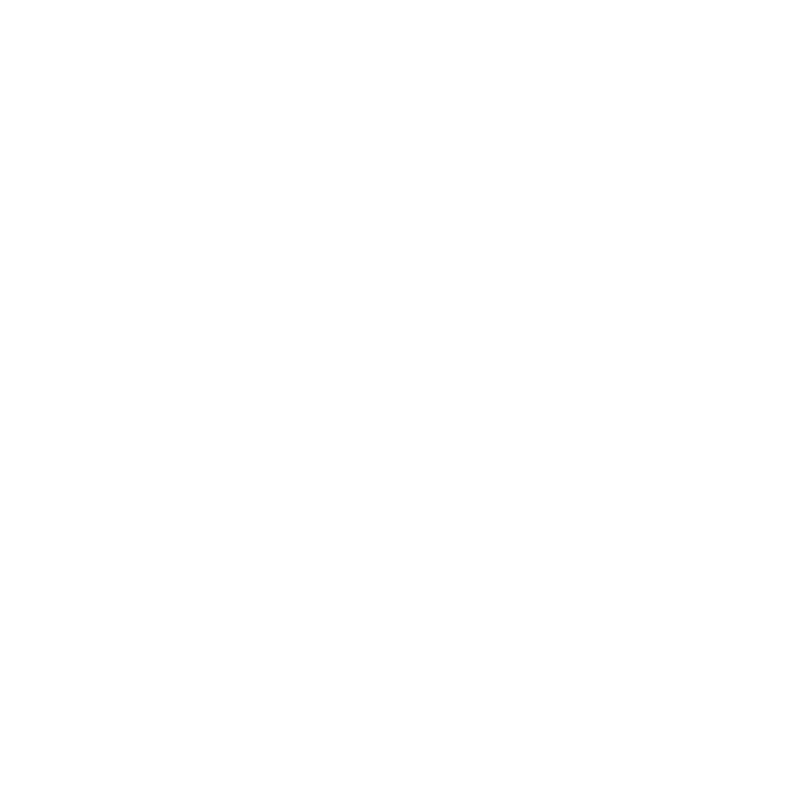
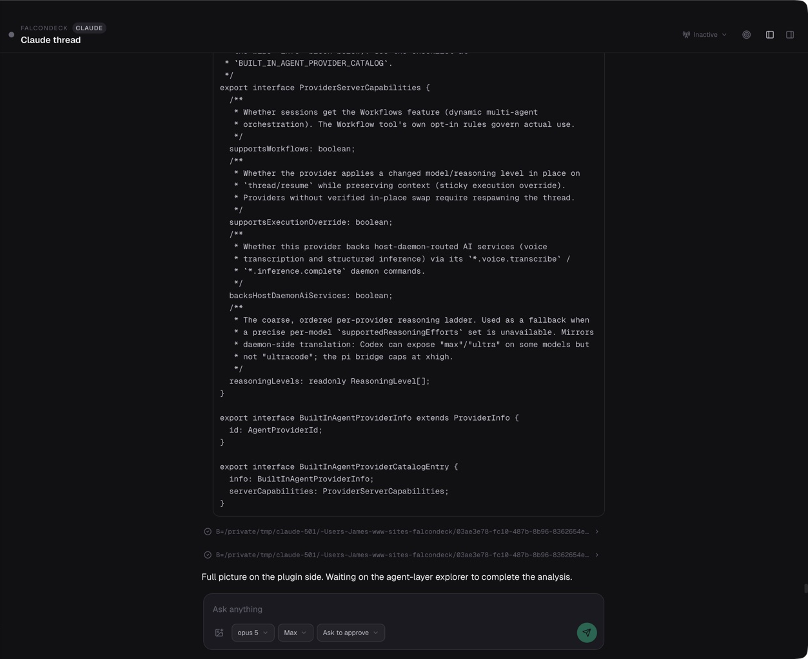
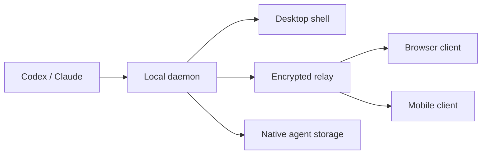

<div align="center">
  
  <h1>FalconDeck</h1>
  <p><strong>The control plane for AI-first companies.</strong></p>
  <p>Start with Codex and Claude close to your code. Run agents from your Mac, browser, or iPhone, and keep the work in one place as more of the company runs in the background.</p>
  <p>
    <a href="https://falcondeck.com">Website</a> ·
    <a href="https://app.falcondeck.com">Open the remote client</a> ·
    <a href="https://github.com/jamesblackwell/falcondeck/releases">Download desktop builds</a> ·
    <a href="docs/00-architecture-overview.md">Architecture</a>
  </p>
</div>

<p align="center">
  
</p>

FalconDeck is open-source infrastructure for companies that run with AI. It starts with coding agents and gives you one place to see workspaces, follow live turns, review diffs, answer questions, and approve actions. The same context stays available when you step away from your desk.

## Why FalconDeck

Most agent interfaces make you choose between a local tool that is hard to reach and a hosted dashboard that becomes the center of your workflow. FalconDeck takes a different shape:

- Your local daemon and native agent storage remain the source of truth.
- The desktop app, browser client, and mobile app are clients of the same daemon contract.
- The relay handles pairing, encrypted transport, replay, and reconnects. It is not a plaintext conversation store.
- You can use the hosted relay or deploy the server-side pieces yourself.

The result is a control surface that feels close to the machine doing the work, while still making remote handoff practical.

## The bigger goal

FalconDeck starts with coding agents because they are the first place where this control problem is becoming real. The longer-term goal is broader: a control plane for AI-first companies that run agents from different harnesses and environments. One place to see what those agents are doing, bring the work together, and involve people when judgment is needed.

That is an ambitious project, and we will need many more contributors to get there. The codebase has room for people interested in Rust daemon work, TypeScript clients, Tauri, React Native, agent integrations, relay infrastructure, product design, documentation, and testing. If that future sounds useful, [join the project on GitHub](https://github.com/jamesblackwell/falcondeck).

## Download

Packaged desktop builds will be published on the [GitHub Releases page](https://github.com/jamesblackwell/falcondeck/releases). Until the first release is available, you can run FalconDeck from source using the local development instructions below.

## What you can do

- Run Codex and Claude sessions side by side from one control plane, with more harnesses to come.
- Organize work by workspace and thread, with persistent restoration across launches.
- Watch streaming responses and tool activity as it happens.
- Review diffs, permission requests, and interactive questions with context.
- Pair trusted devices and continue a session from the web or mobile client.
- Run agents on remote servers: FalconDeck installs its daemon over SSH, the server enrolls through the relay like a paired phone, and sessions keep running when your laptop sleeps.
- Give every agent the same tools: MCP servers declared once in `connectors.json` are passed to Claude, Codex, and any ACP provider at spawn time ([docs/CONNECTORS.md](docs/CONNECTORS.md)).
- Reconnect cleanly after restarts or network changes through the relay event stream.
- Keep same-folder workflows by default instead of forcing a worktree model.

## How it fits together



The daemon is the product. The desktop app is one shell around it, and the remote clients use the same protocol over a relay. This keeps the system easier to reason about and avoids adding a second FalconDeck-owned conversation database.

## Security model

Remote session payloads are end-to-end encrypted between the paired clients. The relay can bridge devices, retain encrypted replay updates, and help clients recover after reconnects, but it is not intended to read the conversation itself.

Pairings are short-lived onboarding state. Trusted devices are the long-lived relationship. When replay is truncated, clients recover from a fresh daemon snapshot rather than assuming the relay contains the complete history.

## Project shape

| Area | Role |
| --- | --- |
| `apps/desktop` | Native Tauri shell around the local daemon |
| `apps/mobile` | Paired mobile client |
| `apps/remote-web` | Paired browser client |
| `apps/site` | Public marketing site |
| `packages/client-core` | Shared TypeScript protocol and client helpers |
| `packages/ui` / `packages/chat-ui` | Shared web UI primitives |
| `crates/falcondeck-core` | Shared Rust protocol and types |
| `crates/falcondeck-daemon` | Local daemon and agent runtime orchestration |
| `crates/falcondeck-relay` | Pairing, encrypted replay, and reconnect bridge |
| `ops/ansible` | Deployment and server configuration |

## Get started

FalconDeck is actively built and the easiest way to explore it is to run the pieces locally.

```bash
npm install

# Start the desktop development stack
make desktop-dev
```

For the public site or paired web client:

```bash
make site-dev
make remote-web-dev
```

The mobile app uses Expo and has a dedicated workflow documented in [`docs/14-mobile-app.md`](docs/14-mobile-app.md). For the full architecture and agent integration paths, start with [`docs/00-architecture-overview.md`](docs/00-architecture-overview.md) and [`docs/02-agent-integration-paths.md`](docs/02-agent-integration-paths.md).

## Self-hosting

FalconDeck defaults to the hosted relay at `connect.falcondeck.com`, but running your own relay is fully supported: every client and server daemon accepts a custom relay URL (desktop exposes it under Settings → Servers → Advanced), and because sessions are end-to-end encrypted, the relay — hosted or yours — never sees plaintext either way.

See [`docs/SELF-HOSTING.md`](docs/SELF-HOSTING.md) for running the relay, pointing clients at it, and serving provisioning binaries. The relay and hosted web stack can also be deployed with the included Ansible setup ([`ops/ansible/README.md`](ops/ansible/README.md), [`docs/11-deployment-ops.md`](docs/11-deployment-ops.md)).

## Help build it

FalconDeck is early-stage open source software. The first focus is a reliable control plane for coding agents. The ambition is bigger, and the project will depend on contributors to make it real. See the [open issues](https://github.com/jamesblackwell/falcondeck/issues) or start a conversation in [GitHub Discussions](https://github.com/jamesblackwell/falcondeck/discussions).

## Status

The core daemon, relay, desktop client, remote web client, mobile client, shared protocol, and marketing site are all in this repository and evolving together.

## License

MIT.
