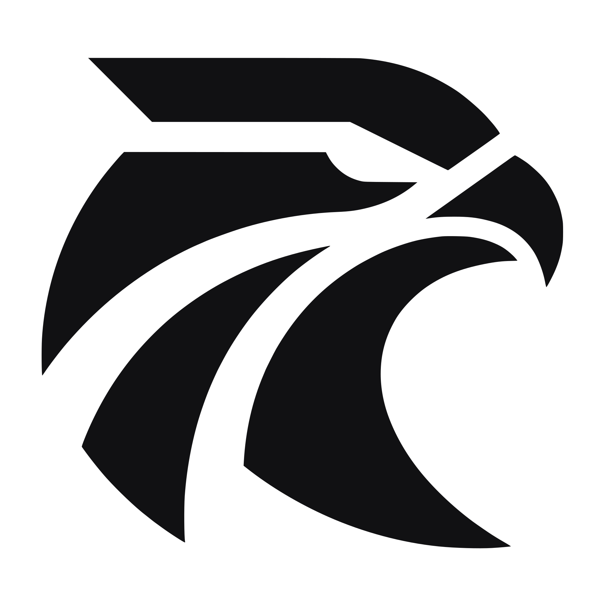
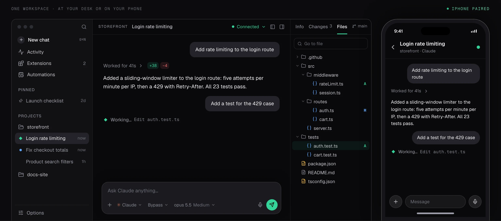
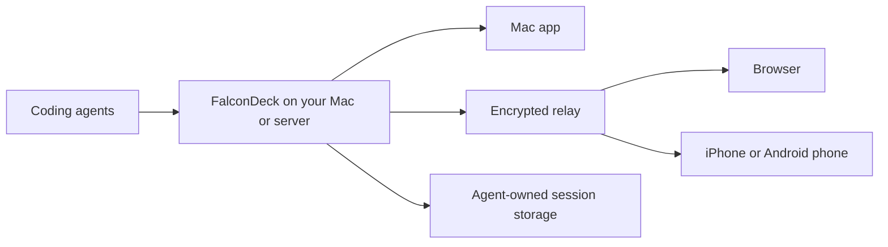

<div align="center">
  <picture>
    <source media="(prefers-color-scheme: dark)" srcset="assets/brand/logomark-mark-light.svg" />
    
  </picture>
  <h1>FalconDeck</h1>
  <p><strong>Your coding agents. A proper Mac app. Keep going from your phone.</strong></p>
  <p>FalconDeck is a free, open-source workspace for Codex, Claude Code, OpenCode, and other coding agents. Bring the accounts and subscriptions you already use, keep your code in your own folders, and choose the tools that suit your work.</p>
  <p>
    <a href="https://falcondeck.com">Website</a> ·
    <a href="https://github.com/jamesblackwell/falcondeck/releases">Download for Mac</a> ·
    <a href="https://apps.apple.com/app/falcondeck/id6760899257">Download for iPhone and iPad</a> ·
    <a href="docs/GETTING-STARTED.md">Getting started</a> ·
    <a href="https://github.com/jamesblackwell/falcondeck/discussions">Questions and feedback</a>
  </p>
</div>

<p align="center">
  
</p>

Spend less time juggling terminals. FalconDeck brings your projects, agent conversations, tool activity, approvals, and changes into one comfortable Mac workspace. Work independently or alongside your team, keep using your favourite editor, and choose a different agent whenever the task calls for it.

Start work at your desk, then step away and follow the same live session from your iPhone or iPad. Read responses, answer questions, approve actions, or send the next instruction without opening your laptop.

FalconDeck is available for Mac, iPhone, and iPad. The desktop app, mobile app, browser client, relay, and local service are all developed in this repository.

## Get started

1. **[Download for Mac](https://github.com/jamesblackwell/falcondeck/releases/latest).** Choose the Apple Silicon (`aarch64`) or Intel (`x64`) DMG, then drag FalconDeck into Applications.
2. **Connect your agent and project.** Setup checks your coding tools and helps you choose a project folder. Use your existing Codex, Claude Code, or other agent account.
3. **Run a first task.** Try: “Explain this project's structure and how to run its tests. Don't change any files.” Follow the response and tool activity in the app.
4. **Optionally continue on your phone.** [Install the free iPhone and iPad app](https://apps.apple.com/app/falcondeck/id6760899257), then open **Settings → Remote Access → Start Pairing** on your Mac and scan the QR code.

Requires macOS 12 or later and a supported coding agent with its own model access. The Mac app works on its own. For remote access to work hosted on your Mac, keep it awake, online, and running FalconDeck.

See the **[getting-started guide](docs/GETTING-STARTED.md)** for setup, pairing, and common questions.

## Why use FalconDeck?

- Give your agents a comfortable workspace. Keep projects, conversations, tool activity, approvals, and changes together instead of juggling terminal windows.
- Use the accounts and subscriptions you already pay for. FalconDeck runs the coding agents installed on your machine rather than reselling access to their models.
- Keep your Mac and phone in sync. You can follow live work, reply to questions, approve actions, and review changes from either device.
- Keep what makes each agent useful. FalconDeck works through the agent's existing coding tool, so you keep its login, models, settings, skills, project instructions, and provider-specific features.
- Choose the right agent for each job. Run different agents side by side, switch easily, or hand a conversation to another agent in a linked thread with its context carried across.
- Avoid lock-in. Your code stays in your own folders, FalconDeck adds no closed conversation database, and every part of the system is open source.
- Use the free hosted relay or run your own. Remote traffic is end-to-end encrypted either way.

## Supported coding agents

FalconDeck currently works with:

- [Codex](https://github.com/openai/codex)
- [Claude Code](https://docs.anthropic.com/en/docs/claude-code/overview)
- Google Antigravity
- [OpenCode](https://opencode.ai)
- [Pi](https://github.com/badlogic/pi-mono)
- [Grok](https://x.ai)
- [Cursor](https://cursor.com)
- Other tools that support the Agent Client Protocol (ACP)

Codex, Claude Code, and Antigravity have direct integrations. OpenCode can use its native service or ACP, while Pi, Grok, Cursor, and other compatible agents connect through ACP. Support varies with the features each agent exposes.

## What you can do

- Keep work organised by project and conversation.
- Watch responses and tool activity as they happen.
- Review file changes, permission requests, and agent questions with the surrounding context.
- Continue a conversation with a different agent without starting the explanation again.
- Use the same MCP tools across Codex, Claude Code, and compatible agents ([connector guide](docs/CONNECTORS.md)).
- Pair trusted phones and browsers without creating a FalconDeck account.
- Run agents on another machine over SSH, so work can continue when your laptop sleeps.
- Reconnect after an app restart or network change without losing the thread.

## Everything is open source

The whole FalconDeck stack is included under the MIT license:

- the native Mac app
- the mobile app for iOS and Android
- the browser client
- the local service that runs your agents
- the encrypted relay server
- the deployment tools for self-hosting

The hosted FalconDeck relay is free to use. If you would rather own the full path, you can run the relay and web client on your own server. See the [self-hosting guide](docs/SELF-HOSTING.md).

The free iPhone and iPad app is [available on the App Store](https://apps.apple.com/app/falcondeck/id6760899257). Android can be built from the same mobile source.

## How FalconDeck works


```mermaid
flowchart LR
    A[Coding agents] --> B[FalconDeck on your Mac or server]
    B --> C[Mac app]
    B --> D[Encrypted relay]
    D --> E[Browser]
    D --> F[iPhone or Android phone]
    B --> G[Agent-owned session storage]
```

A small local service starts the coding agents and turns their different outputs into one consistent experience. The Mac app, browser client, and mobile app all connect to that service. The agents remain responsible for their own sessions and configuration; FalconDeck does not create a second conversation database.

When you connect remotely, session data is encrypted between your paired devices. The relay moves encrypted updates and helps devices reconnect, but it cannot read the conversation itself. You can use the hosted relay or replace it with your own.

## Project layout

| Area | What it contains |
| --- | --- |
| `apps/desktop` | Mac app |
| `apps/mobile` | iOS and Android app |
| `apps/remote-web` | Browser client |
| `apps/site` | Public website |
| `packages/client-core` | Shared client behaviour and types |
| `packages/ui` / `packages/chat-ui` | Shared interface components |
| `crates/falcondeck-core` | Shared Rust types |
| `crates/falcondeck-daemon` | Local agent runner and API |
| `crates/falcondeck-relay` | Pairing, encrypted updates, and reconnection |
| `ops/ansible` | Self-hosting and deployment setup |

## Run it from source

FalconDeck currently requires macOS, Node.js, Rust, and at least one supported coding agent installed and signed in.

```bash
npm install

# Start the Mac development app
make desktop-dev
```

To work on the public site or browser client:

```bash
make site-dev
make remote-web-dev
```

The mobile app uses Expo. If you want to build your own version, see the [mobile development guide](docs/14-mobile-app.md).

For technical detail, start with the [architecture overview](docs/00-architecture-overview.md), [agent integration guide](docs/02-agent-integration-paths.md), and [adapter guide](docs/ADAPTERS.md).

## Self-hosting

FalconDeck uses the hosted relay at `connect.falcondeck.com` by default. Every client and server can instead use a custom relay URL. The desktop setting is under Settings → Servers → Advanced.

The [self-hosting guide](docs/SELF-HOSTING.md) explains how to run the relay, connect your apps, and serve installation files. An Ansible setup is also included for deploying the relay and hosted web app ([deployment guide](ops/ansible/README.md)).

## Help build it

FalconDeck is starting with coding agents, but the aim is a simple, open place to follow and direct many kinds of agent work. Contributions to the apps, integrations, infrastructure, design, docs, and testing are welcome.

Read the [contribution guide](CONTRIBUTING.md), [report a bug](https://github.com/jamesblackwell/falcondeck/issues/new/choose), or share your workflow in [GitHub Discussions](https://github.com/jamesblackwell/falcondeck/discussions).

FalconDeck is early and actively developed, and already used for daily coding work. If it helps you, [star the project on GitHub](https://github.com/jamesblackwell/falcondeck) to help others discover it.

## License

[MIT](LICENSE). The apps, local service, relay, and self-hosting tools are all included.
