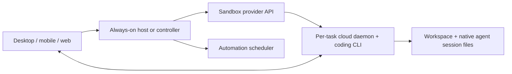

# Cloud execution: BB, reference implementations, and FalconDeck UX

Researched 2026-10-05. This extends [the provider and integration research](CLOUD-SANDBOXES.md) with a source review of the adjacent `../bb` checkout and three public implementations. It is a design proposal; no cloud service was deployed or tested. UI recommendations below are proposed behavior, not existing FalconDeck features. Product copy uses “task”; “thread” describes internal ownership.

## Recommended direction

Add **Cloud copy** to the existing **Project folder / Isolated copy** menu. Configure one cloud provider in Settings. Create an environment for each new cloud task and keep that environment for its follow-up prompts, suspending compute between sessions. Review and bring back its changes through the normal task experience.

Treat three promises separately: running an already-started task remotely, starting/resuming tasks from a phone while the Mac is off, and running future automations while the Mac is off. The latter two need a service that remains available to allocate or wake compute. A sandbox API key on the Mac cannot provide that service while the Mac sleeps.

For a personal setup, an always-on FalconDeck daemon on an enrolled server is the shortest path to work that can start without the Mac. For the sandbox experiment, retain **Vercel first**, benchmark **E2B**, and add **Modal** to the serious alternatives because BB and Open-Inspect offer useful implementations to study. Cloudflare is also a candidate for a future orchestration service; that is a separate choice from the execution provider.

## What BB actually does

The local checkout was clean at `5d31d8c32d85d7bde75d211b8295836b33fc2a26`, committed October 5. The attached notes correctly identify a server, execution machines, and remote-access services. However, I verified a **Modal** execution plugin at this revision and found no Vercel, E2B, or Cloudflare Sandbox execution backend in the inspected core/plugin source. The notes' Vercel claim is unconfirmed; this does not rule out an external plugin or a different revision.

| Part | Verified behavior | Consequence for the user |
| --- | --- | --- |
| BB server | Owns the database, threads, settings and coordination; browser/mobile clients and execution machines connect to it | Put this server on an always-on machine to use BB when the laptop is off |
| Modal machine | Allocated in the user's Modal account; installs/enrolls a BB host daemon and runs agents there | Cloud execution requires compute credentials, agent authentication and a reachable BB server |
| Project/environment | The machine receives a clone of the project's Git remote and checkout setup | Local uncommitted edits and unpushed commits are not automatically transferred |
| Machine ownership | Core distinguishes thread-created machines from standalone machines | A task can own a fresh machine, or several tasks can use an existing machine |
| BB connect | Cloudflare Worker, Durable Object and D1 configuration supports remote access/tunnels | Cloudflare hosting here does not imply Cloudflare Sandbox execution |

Evidence: [multi-device architecture](https://github.com/get-bb/bb/blob/5d31d8c32d85d7bde75d211b8295836b33fc2a26/docs/multiple-devices.md), [Modal integration](https://github.com/get-bb/bb/blob/5d31d8c32d85d7bde75d211b8295836b33fc2a26/plugins/environment-modal-sandbox/README.md), [project cloning](https://github.com/get-bb/bb/blob/5d31d8c32d85d7bde75d211b8295836b33fc2a26/apps/server/src/services/projects/project-source-setup.ts#L69), [machine lifetime](https://github.com/get-bb/bb/blob/5d31d8c32d85d7bde75d211b8295836b33fc2a26/apps/server/src/services/machines/provider-orchestration.ts#L480), [connect configuration](https://github.com/get-bb/bb/blob/5d31d8c32d85d7bde75d211b8295836b33fc2a26/apps/connect/wrangler.jsonc).

### BB's launch and pause flows

The optional plugin exposes a new sandbox through the project/machine picker. Settings holds the Modal token pair, idle interval, named sizes and images. The launch UI hides the additional size/image selector when there is only one choice. This is a useful precedent for our one-provider default. [Settings descriptors](https://github.com/get-bb/bb/blob/5d31d8c32d85d7bde75d211b8295836b33fc2a26/plugins/environment-modal-sandbox/configuration.ts), [conditional selector](https://github.com/get-bb/bb/blob/5d31d8c32d85d7bde75d211b8295836b33fc2a26/plugins/environment-modal-sandbox/app.tsx#L115).

Fresh creation builds/reuses a tools image, allocates compute, records its vendor identity, bootstraps the host daemon, then provisions a project checkout. Credentials and enrollment are supplied separately from the reusable image. The image cache key is the Dockerfile hash. Fresh project checkout setup uses `.bb-env-setup.sh`. These are distinct stages that can fail independently. [Provider registration and bootstrap](https://github.com/get-bb/bb/blob/5d31d8c32d85d7bde75d211b8295836b33fc2a26/plugins/environment-modal-sandbox/providers/register.ts), [provisioning ownership](https://github.com/get-bb/bb/blob/5d31d8c32d85d7bde75d211b8295836b33fc2a26/docs/environment-provisioning.md).

Idle suspension defaults to 15 minutes. A server-side scheduled sweep requests suspension; this depends on the BB server being online. Core coordinates stopping work and shutting down the daemon. The plugin saves a filesystem snapshot with `ttlMs: null`, durably records it, and then terminates compute. Resume allocates from that snapshot and reattaches the same BB machine identity. Files and dependencies survive; live terminals/processes do not, and interrupted turns are not automatically replayed. [Idle sweep](https://github.com/get-bb/bb/blob/5d31d8c32d85d7bde75d211b8295836b33fc2a26/plugins/environment-modal-sandbox/server.ts#L117), [shutdown coordination](https://github.com/get-bb/bb/blob/5d31d8c32d85d7bde75d211b8295836b33fc2a26/apps/server/src/services/machines/provider-orchestration.ts#L641), [snapshot and restore](https://github.com/get-bb/bb/blob/5d31d8c32d85d7bde75d211b8295836b33fc2a26/plugins/environment-modal-sandbox/providers/modal/backend.ts#L315).

BB's documented limitation matters: it has no pre-expiry snapshot scheduler. Its Modal compute expires after 24 hours, so changes since the last successful save can be lost. Do not reproduce this gap in a feature sold as unattended work. Modal currently defaults filesystem snapshots to 30-day retention, but permits opting out; BB explicitly opts out. Modal also has an alpha memory-snapshot feature, which BB's filesystem flow does not use. [BB lifecycle limitations](https://github.com/get-bb/bb/blob/5d31d8c32d85d7bde75d211b8295836b33fc2a26/plugins/environment-modal-sandbox/README.md#lifecycle), [Modal lifetime](https://modal.com/docs/guide/sandboxes#timeouts), [snapshot types and retention](https://modal.com/docs/guide/sandbox-snapshots).

The patterns to take are stable environment identity, separate compute lifetime, small composer controls, reusable images without baked credentials, and durable allocation/checkpoint records. FalconDeck should keep its own daemon/native-agent history model: BB's central thread database is a different architecture. [FalconDeck adapter ownership](ADAPTERS.md), [remote hosts](REMOTE-HOSTS.md).

## The levels of cloud execution

These are architecture choices, not five options to put into the composer.

| Level | User experience | With the Mac off | Main trade-off |
| --- | --- | --- | --- |
| Local agent with cloud execution tools | Agent conversation stays on the Mac; selected commands run remotely | Agent itself cannot continue | Useful execution offload, but does not satisfy the main cloud-task goal |
| Whole daemon on an enrolled server | Connect to the server, select its checkout, use ordinary tasks and automations | Start, approve and continue tasks while that server stays online | Server setup and ongoing compute; no automatic sandbox isolation per task |
| Per-task sandbox, provisioned by the Mac | Select Cloud copy; upload current source; use a remote daemon | A started turn can continue within its tested lifetime; new allocation/resume still requires an available controller | Smallest sandbox feature, with a limited offline promise |
| Always-on controller plus per-task sandboxes | Same Cloud copy interaction; phone and schedules can create or wake environments | New tasks, follow-ups and automations work without the Mac | Controller deployment, credentials, lifecycle recovery and durable workspace/session storage |
| Managed FalconDeck service | Sign in, connect repositories, start cloud tasks from any device | Full offline capability through the hosted service | Accounts, billing, tenant isolation, operations and data-retention responsibilities |

The enrolled-server row builds on FalconDeck's existing remote-host and daemon scheduler architecture. Per-task sandboxes and a cloud controller are proposed additions. A controller may be an always-on user-owned FalconDeck host initially. A managed service is a later product decision. [Current source/integration mapping](CLOUD-SANDBOXES.md#integration-with-the-actual-falcondeck-architecture), [automation ownership](SCHEDULED_TASKS.md).

An already-running sandbox can receive mobile approvals directly only after the cloud host has its own trusted-device access. A sleeping sandbox needs an available controller to wake it. Code required for an offline launch must already be available as an uploaded snapshot or in an accessible Git remote; the controller cannot fetch new dirty edits from an offline Mac.



The last direct connection represents FalconDeck's authenticated host transport. Keep the relay as transport. An orchestration service owns job/allocation metadata and snapshot references; it must not introduce a second conversation database. Native agent files must survive worker replacement. A stopped environment also needs a history-read plan: resume it on demand, or provide an authenticated reader for durable native session files. A task row alone is not conversation recovery.

## Proposed UI and UX

### Settings and starting a task

Use **Settings → Cloud execution** with one connection initially. Display provider account/project identity, connection status, the default environment image, idle policy and compute limit. Keep advanced CPU/image choices behind an expanded panel. Compute access, agent authentication and repository access are three separate connections; successfully validating a sandbox key does not establish the other two.

Offer **Cloud copy** in the existing execution menu. First use can open connection setup while retaining the draft. Once configured, the default provider needs no separate picker. If multiple connections eventually exist, show the provider chooser only after selecting Cloud copy. Remember the last mode per project, with Project folder remaining the initial default.

```text
FalconDeck project   ·   Cloud copy: Vercel   ·   Codex
Source: Current code, including local changes
Excluded files: 8                         Review upload

[Describe the task…]                             Start
```

“Current code” means a frozen copy of the selected working state, including staged/unstaged changes and eligible untracked files. It does not continuously sync. Show excluded secrets, ignored files and large/unsupported inputs before upload; preserve the local index. Configure runtime secrets separately. A later **Git repository / branch** source is useful for phone starts and scheduled work, but it must clearly say that local edits and unpushed commits are absent. Do not call both sources “your project” without explaining the difference. [Snapshot/import design](CLOUD-SANDBOXES.md#exactly-what-happens-to-dirty-files).

Provision only after Start in the first release. Open-Inspect's speculative warming is useful at scale, but starting paid resources while someone merely types introduces avoidable cost and cancellation work for this experiment.

### Progress and follow-ups

Show the same task immediately with stages such as **Preparing environment → Copying code → Installing dependencies → Starting Codex**. Keep the prompt queued until the native agent is ready. A failed dependency install needs a visible log and retry action; an uncertain agent dispatch must not be blindly resent. Cancellation owns cleanup even if vendor allocation returns late.

Once started, use a compact **Cloud · Vercel · Running** status. File browsing, changes, terminal, approvals, interrupt and further prompts all belong to that cloud environment. “Open in editor” needs a cloud-capable route or an export action; a Linux workspace path cannot be opened as a Mac folder.

Follow-ups reuse the same environment and native conversation. Sleep stops compute, not the task. The next prompt resumes saved files and explicitly restarts the required daemon/services. For providers with memory persistence, process continuity is a capability to verify, not a guarantee to make across all providers.

### Costs, interruption and retention

Keep environment status distinct from agent status: a task can be waiting for approval while its compute is still running. Display a configured session deadline, the last saved checkpoint and whether compute is active. Use **Stop agent**, **Save and sleep**, and **Delete cloud environment** as distinct actions. Archiving a conversation must not silently delete its results.

Automatic idle sleep should require no active turn, approval wait, terminal or provisioning operation. At a hard provider deadline, an available lifecycle owner should stop new dispatch, interrupt remaining work, flush native session files and checkpoint with a safety margin. Make the interruption visible and require an explicit continuation; an interrupted tool operation can already have caused external effects. Before claiming unattended reliability, test timeout/checkpoint behavior with the provisioning Mac disconnected.

Always-on lifecycle management must run on a host/controller that remains online. A local controller alone cannot enforce an early idle shutdown after the Mac sleeps; provider timeout is its fallback. Budget controls should distinguish compute from retained storage and agent usage. Show retention policy, export completed changes, and report a missing snapshot explicitly instead of silently opening a fresh environment under the old task.

### Bringing changes back

The cloud changes view should offer **Bring back changes** and, when Git access is configured, **Create pull request**. Keep both explicit.

Compare the result with the exact uploaded baseline, including changes the agent committed. The user's original dirty files are already part of that baseline. If a locally affected file changed since upload, show a conflict/review copy instead of overwriting it. Preserve staged state when importing. Subsequent Mac edits are not automatically uploaded over cloud edits. [Three-state import model](CLOUD-SANDBOXES.md#bringing-work-back).

### Isolation and reuse

Default to one environment per cloud task and reuse it across that task's prompts. Reuse prebuilt images/dependency caches to reduce setup time. Sharing a writable checkout between unrelated agents should be an explicit advanced choice because those agents can edit each other's files.

An **Environments** screen becomes useful once users need a standalone cloud machine, several configurations, or recovery/cleanup across tasks. It need not be a mandatory first-run concept. A “clone this task into another cloud environment” action should create a new task with a defined source checkpoint; changing the execution selector on an existing native conversation is not a simple move.

## Open-source implementations worth studying

All four are references to study rather than dependencies to adopt. The inspected revisions and source links below make the comparison reproducible; repository stars are not evidence of reliability.

| Reference | What it demonstrates | Main caveat |
| --- | --- | --- |
| [BB](https://github.com/get-bb/bb/tree/5d31d8c32d85d7bde75d211b8295836b33fc2a26) — MIT | Native agents on enrolled Modal machines, thread/standalone ownership, reusable images, filesystem sleep | Central server must remain online; clone-first source flow; documented expiry/save gap |
| [Open-Inspect](https://github.com/ColeMurray/background-agents/tree/e364a7eec0342283c3fa8cfb9e957aee9f467559) — MIT | Hosted controller, repository picker, background tasks, multiple sandbox providers, scheduled work, durable recovery | Single-tenant deployment; OpenCode/Claude Agent SDK harnesses differ from FalconDeck's native adapters |
| [Vercel coding-agent-template](https://github.com/vercel-labs/coding-agent-template/tree/e753e1b6d28b2d64446dd5f9ef33a93909cc7a09) — Apache-2.0 | Choose repo/agent, track task logs, review a branch, choose whether to keep compute available | Main revision is February 12 and pins Sandbox `^0.0.21`; its CLI approval bypass and request-based orchestration should not be copied |
| [Cloudflare VibeSDK](https://github.com/cloudflare/vibesdk/tree/9da158d82c597a0e8f4bf033cdccd1053fb6fb15) — MIT | Integrated files, preview, restore points and export in a hosted coding product | Current Think/SpaceDO path uses explicit workspace tools with bash disabled; not a native Codex/Claude sandbox runner |

BB's reviewed commit is October 5; Open-Inspect's main commit is October 4 and includes a provisioning/queued-prompt recovery fix. VibeSDK's inspected main revision is September 7. Vercel's repository has later push activity, but that does not make the February main implementation current with today's Sandbox APIs. Licenses were read from their license files, including Vercel's Apache notice despite GitHub metadata returning `NOASSERTION`. [BB license](https://github.com/get-bb/bb/blob/5d31d8c32d85d7bde75d211b8295836b33fc2a26/LICENSE), [Open-Inspect license](https://github.com/ColeMurray/background-agents/blob/e364a7eec0342283c3fa8cfb9e957aee9f467559/LICENSE), [Vercel license](https://github.com/vercel-labs/coding-agent-template/blob/e753e1b6d28b2d64446dd5f9ef33a93909cc7a09/LICENSE), [VibeSDK license](https://github.com/cloudflare/vibesdk/blob/9da158d82c597a0e8f4bf033cdccd1053fb6fb15/LICENSE).

### Strongest additional reference: Open-Inspect

The important call path is: persist/enqueue prompt → defer while the sandbox boots → request spawn/resume through the lifecycle manager → select a vendor adapter → start the runtime bridge → dispatch when the agent reports ready. The controller and worker are separate, so losing a browser connection does not remove job ownership. Its controller also records provider expiry and schedules shutdown before it, then uses a saved recovery receipt to decide whether it can restore a snapshot or resume retained compute. [Prompt queue](https://github.com/ColeMurray/background-agents/blob/e364a7eec0342283c3fa8cfb9e957aee9f467559/packages/control-plane/src/session/message-queue.ts#L453), [lifecycle manager](https://github.com/ColeMurray/background-agents/blob/e364a7eec0342283c3fa8cfb9e957aee9f467559/packages/control-plane/src/sandbox/lifecycle/manager.ts#L533), [expiry/save ownership](https://github.com/ColeMurray/background-agents/blob/e364a7eec0342283c3fa8cfb9e957aee9f467559/packages/control-plane/src/session/sandbox-shutdown.ts#L236).

Its provider abstraction distinguishes retained resume from snapshot restore and records lifetime uncertainty explicitly. The E2B adapter configures auto-pause, requires authenticated sandbox execution, and launches its supervisor detached. The Vercel adapter verifies snapshot creation/source-stop responses. A hosted scheduler processes overdue automations and initializes sessions. These are useful references for contracts and failure behavior; the large orchestration subsystem is not a reason to reproduce its whole architecture. [Capabilities/lifetime contract](https://github.com/ColeMurray/background-agents/blob/e364a7eec0342283c3fa8cfb9e957aee9f467559/packages/control-plane/src/sandbox/provider.ts#L54), [provider factory](https://github.com/ColeMurray/background-agents/blob/e364a7eec0342283c3fa8cfb9e957aee9f467559/packages/control-plane/src/sandbox/provider-factory.ts), [E2B adapter](https://github.com/ColeMurray/background-agents/blob/e364a7eec0342283c3fa8cfb9e957aee9f467559/packages/control-plane/src/sandbox/providers/e2b-provider.ts), [Vercel snapshot adapter](https://github.com/ColeMurray/background-agents/blob/e364a7eec0342283c3fa8cfb9e957aee9f467559/packages/control-plane/src/sandbox/providers/vercel/provider.ts#L250), [scheduler](https://github.com/ColeMurray/background-agents/blob/e364a7eec0342283c3fa8cfb9e957aee9f467559/packages/control-plane/src/scheduler/scheduler.ts#L857).

Do not use Open-Inspect's single-tenant authorization model as a managed FalconDeck service template. Its own documentation identifies repository-access and snapshot-credential boundaries. Our approval/native-session contracts also remain necessary even when the outer environment is isolated. [Deployment boundaries](https://github.com/ColeMurray/background-agents/blob/e364a7eec0342283c3fa8cfb9e957aee9f467559/README.md#security-model-single-tenant-only).

### Useful alternatives, with specific limits

Vercel's template has a straightforward repo/task/branch workflow and a Keep Alive control for iteration. Its creation path clones the Git remote. However, the task route uses Next.js `after()` for execution, and its Codex adapter invokes `codex exec --dangerously-bypass-approvals-and-sandbox`, with `--last` for resumption. Study the interaction; retain FalconDeck's `codex app-server`, approval handling, exact native session identity and independent daemon execution. The template's older maximum-duration descriptions are not current provider limits. [Creation](https://github.com/vercel-labs/coding-agent-template/blob/e753e1b6d28b2d64446dd5f9ef33a93909cc7a09/lib/sandbox/creation.ts#L81), [task dispatch](https://github.com/vercel-labs/coding-agent-template/blob/e753e1b6d28b2d64446dd5f9ef33a93909cc7a09/app/api/tasks/route.ts#L213), [Codex adapter](https://github.com/vercel-labs/coding-agent-template/blob/e753e1b6d28b2d64446dd5f9ef33a93909cc7a09/lib/sandbox/agents/codex.ts#L278), [SDK dependency](https://github.com/vercel-labs/coding-agent-template/blob/e753e1b6d28b2d64446dd5f9ef33a93909cc7a09/package.json#L42).

VibeSDK's current ThinkAgent offers file tools, commit, deployment and browser-console inspection through a SpaceDO workspace. This is useful UX evidence for preview/results/history, but a different runtime product. Older descriptions of VibeSDK as a generic Cloudflare Sandbox CLI app are insufficient for the inspected revision. [Current tools](https://github.com/cloudflare/vibesdk/blob/9da158d82c597a0e8f4bf033cdccd1053fb6fb15/worker/agents/think/ThinkAgent.ts#L322), [workspace RPC](https://github.com/cloudflare/vibesdk/blob/9da158d82c597a0e8f4bf033cdccd1053fb6fb15/worker/agents/think/space-workspace-ops.ts), [Cloudflare's separate CLI runner example](https://developers.cloudflare.com/sandbox/get-started/build-a-coding-agent-runner/).

Search covered provider-specific coding-agent templates, Modal background agents/Open-Inspect, cloud coding UIs, and BB's execution backends. Forks and generic code-interpreter examples were excluded from the shortlist. No reference application was installed or run, and this source review does not establish production reliability.

## Implementation sequence

1. Prove a headless FalconDeck daemon, Codex app-server and native session restore in one Linux sandbox. Verify detached execution, approvals, files, interruption, hard timeout and result recovery with the Mac disconnected. Keep Claude on the CLI subprocess path when added.
2. Add one Vercel connection and Cloud copy with current-source capture, remote workspace ownership, visible launch progress, same-environment follow-ups, retention and explicit change import. Keep cloud-thread routing independent of the source project's local path.
3. Benchmark E2B and Modal against the same task and sleep/restore flow. Decide from startup, setup cost, session recovery and image needs, rather than repository popularity. Current Vercel disk persistence, E2B pause/resume and Modal filesystem restoration must map to their actual capabilities. [Vercel persistence](https://vercel.com/docs/sandbox/concepts/persistent-sandboxes), [E2B persistence](https://docs.e2b.dev/sandbox/persistence), [Modal snapshots](https://modal.com/docs/guide/sandbox-snapshots).
4. Add always-on ownership using an enrolled server first: provisioning/resume controls, durable checkpoints, mobile grants and automations belong there. Use pinned uploads or accessible Git sources for offline launches. Offer hosted controller deployment only when that setup is justified.
5. Consider managed FalconDeck Cloud after the workflow is useful. Repository sign-in, hosted orchestration and user billing can simplify onboarding, but require their own implementation and operational plan.

The first product boundary is a cloud task with recoverable files and native conversation state. Persistent server access provides an immediate alternative for users who mainly want phone access and overnight automations. Reusable standalone cloud machines, prewarming and multiple provider connections can follow demonstrated demand.
