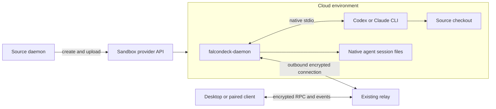

# Cloud sandboxes for FalconDeck

Researched 2026-10-05. Proposal for an experiment; no cloud integration is implemented by this document. Vercel, Cloudflare, and E2B received the detailed documentation review; Daytona received a shorter comparison. Conclusions are based on current provider documentation and FalconDeck source, without provisioning paid resources or benchmarking a live sandbox.

The follow-up [cloud execution and UX comparison](CLOUD-EXECUTION-UX.md) examines BB's Modal implementation, additional open-source references, and the different requirements for remote turns, phone starts and offline automations.

## Recommendation

Start with **Vercel Sandbox**, implement one configured cloud connection, and use **E2B** as the comparison for the initial technical experiment. Keep **Modal** and **Daytona** on the shortlist: Modal has relevant BB/Open-Inspect implementations to study, while Daytona offers additional environment and lifecycle options. Add **Cloudflare** after proving the experience, or sooner if we specifically want a Cloudflare-hosted orchestration service.

This is a recommendation about FalconDeck's integration effort and intended experience, not a claim that Vercel has the most sandbox customers. Vercel now has persistent sandboxes, custom Linux images, detached commands, and up to 24-hour sessions on paid plans. Older descriptions of it as an ephemeral, short-lived Node/Python environment are no longer an adequate basis for choosing a provider. [Current overview](https://vercel.com/docs/sandbox), [persistence](https://vercel.com/docs/sandbox/concepts/persistent-sandboxes), [limits](https://vercel.com/docs/sandbox/pricing).

The feature should mean: **start a thread against a cloud copy of this project's current source, keep the normal FalconDeck conversation and approval experience, then review and bring back the agent's changes**. Keep execution location separate from the chosen agent and model.

## Adoption and popularity

There is no comparable public market-share measure for these four products. The useful signals are specialist adoption, maintained integration examples, and commercial platform support.

| Provider | Evidence observed | Interpretation |
| --- | --- | --- |
| E2B | About 14.2k GitHub stars; reports over a billion sandbox starts and 88 Fortune 100 companies signed up | Strong evidence of interest and adoption in agent infrastructure; signups are not a production-customer count. |
| Daytona | About 71.7k stars on the historical public core repository; current SDK/service changelog remains active | Large community interest, but the old repository is archived and no longer represents maintained core development. |
| Vercel | About 208 stars on its sandbox SDK repository; publishes a Cursor Cloud Agents integration and a multi-harness coding-agent template | Small SDK star count does not measure adoption of the commercial platform. Relevant coding-agent integrations exist. |
| Cloudflare | About 1.1k stars on sandbox-sdk; announced Sandbox general availability in April 2026; publishes Codex and Claude runners | Established platform with a real coding-agent path; some persistence features still carry a beta designation. |

Star counts were read from GitHub's repository API on the research date and are approximate here. They measure repository interest, not usage. Sources: [E2B repository](https://github.com/e2b-dev/E2B), [E2B adoption claims](https://e2b.dev/about), [Daytona repository and maintenance notice](https://github.com/daytonaio/daytona), [Daytona changelog](https://www.daytona.io/changelog), [Vercel SDK](https://github.com/vercel/sandbox), [Cursor integration](https://vercel.com/changelog/run-cursor-cloud-agents-vercel-sandbox), [coding-agent template](https://vercel.com/templates/ai/coding-agent-platform), [Cloudflare SDK](https://github.com/cloudflare/sandbox-sdk), [Cloudflare GA announcement](https://www.cloudflare.com/press/press-releases/2026/cloudflare-expands-its-agent-cloud-to-power-the-next-generation-of-agents/).

Daytona's maintenance notice says core development moved to a private codebase in June 2026. The public repository was archived on October 3. Its hosted product remains a viable candidate, but the previous open-source core should not be described as an actively maintained self-hosting option.

## What the providers actually require

| Property | Vercel | E2B | Cloudflare | Daytona, shorter review |
| --- | --- | --- | --- | --- |
| Initial connection | Access token, team ID, project ID | Project API key | Account and deployed Worker/container application; authenticate requests to our Worker | Organization API key |
| Create environment | External JS/Python SDK | External JS/Python SDK, templates | Worker calls a Durable Object, which starts a Linux container instance | SDK/API, images and snapshots |
| Upload local source | File APIs, or tarball URL | File APIs, upload/download URLs | Worker streams files into container | File APIs |
| Background execution | Detached command | Background command with process reconnect | Detached process, durable status files, DO alarm | Async session commands |
| Preserve workspace | Automatic filesystem snapshot on stop | Pause saves filesystem and memory by default | Application saves/restores filesystem snapshot or R2 backup | Stop/start retains filesystem; VM pause also retains memory |
| Preserve running processes | Relaunch after filesystem restore | Usually restored after memory pause; support cold-boot fallback | Relaunch after restore | Depends on sandbox class; VM pause supports it |
| Runtime constraint | Hobby 45 min; Pro/Enterprise 24h per session | Hobby 1h; Pro 24h between pauses | Inactivity management; executing Linux code alone does not keep instance alive | Configurable lifecycle; unattended jobs must disable auto-stop/auto-pause or have an external keeper |
| Main integration burden | Lifecycle and source/result transport | Same, with memory pause behavior | Deploy and maintain Worker, DO, image, liveness and persistence | Lifecycle differences between container and VM classes |

### Vercel: strongest first experiment

For a desktop application, use a Vercel access token with team/project IDs. Vercel's recommended OIDC path is useful when the controlling application itself runs on Vercel; a pulled development OIDC token expires after 12 hours and is a poor long-term Settings credential. Discover/select the team and project during setup rather than requiring users to find IDs manually. [Authentication](https://vercel.com/docs/sandbox/concepts/authentication).

The JS SDK provides `Sandbox.create`, `runCommand({ detached: true })`, `getCommand`, `writeFiles`, and streamed `readFile`. Creation can clone a Git revision, fetch a tarball, or start from a snapshot. None of those automatically captures dirty files from the user's Mac. FalconDeck must assemble and upload that source itself. Current managed images include coding agents; a released integration should still pin a tested image and harness versions. [SDK reference](https://vercel.com/docs/sandbox/sdk-reference), [images and environment](https://vercel.com/docs/sandbox).

Persistence is on by default. A stopped sandbox restores its disk into a new VM session; bootstrap the daemon again and resume the native agent session. Use a stable per-thread name, explicit timeout, and a bounded snapshot policy. The default snapshot expiration is 30 days since last use. Importantly, `getOrCreate` can recreate a sandbox whose snapshot expired: an existing thread must detect that condition and report its workspace as expired, rather than silently replacing its history with a fresh environment. Deleting a sandbox leaves snapshots behind. [Persistence semantics](https://vercel.com/docs/sandbox/concepts/persistent-sandboxes).

Vercel can inject credential headers outside the VM through its firewall, with destination/request matching. This is worth testing for agent API access so a model API key need not be written into the project or image. No Vercel hosting token should enter the workload sandbox. [Firewall and credential brokering](https://vercel.com/docs/sandbox/concepts/firewall).

### E2B: best comparison for agent continuity

Connection setup is a project API key. The `e2b` SDK supports general Linux commands and filesystem operations; its code-interpreter package is optional for a coding CLI. Prebuilt `codex` and `claude` templates demonstrate running both agents, streaming events, and resuming sessions. We would package FalconDeck's daemon alongside the harness instead of adopting the guides' `codex exec` orchestration as our product interface. [API keys](https://docs.e2b.dev/api-key), [Codex guide](https://docs.e2b.dev/agents/codex), [Claude guide](https://docs.e2b.dev/agents/claude-code).

A background command survives disconnection from the SDK. Reattachment uses sandbox/process IDs, but logs should be written to files when they must be collected by a different client later. This is a good match for bootstrapping a daemon that then communicates through FalconDeck's relay. [Background commands](https://docs.e2b.dev/commands/background).

Pause normally saves both memory and disk, and paused sandboxes have indefinite retention. Configure timeout behavior explicitly: the default `onTimeout` is `kill`, so forgetting this would destroy an idle thread. Use the pause action. Network connections need reattachment after resume; recent documentation also describes a filesystem-only fallback during snapshot backlogs. Correctness should rely on durable native agent sessions even when memory restoration is available. [Pause/resume](https://docs.e2b.dev/sandbox/persistence), [lifecycle](https://docs.e2b.dev/sandbox).

E2B also documents secret injection through its egress proxy, but that feature is currently private beta. The first integration must work without access to it. [Secret availability](https://docs.e2b.dev/secrets).

### Cloudflare: capable, with more infrastructure to own

Use the Linux Container path. Dynamic Workers are for JavaScript against supplied methods and do not provide the ordinary Linux process/filesystem environment needed by our coding CLIs. [Environment choice](https://developers.cloudflare.com/sandbox/concepts/).

The current documentation distinguishes its 1.0 approach from the older 0.x `getSandbox`/`Sandbox` examples. A Worker routes a sandbox name to a Durable Object. The DO owns container `start`, `exec`, and lifecycle methods; `@cloudflare/sandbox` supplies file, mount, and backup helpers. We would deploy a small authenticated FalconDeck Worker and image to the user's account, or connect to a previously deployed instance. An account API token alone is not a ready-to-use desktop sandbox connection. [Current package contract](https://developers.cloudflare.com/sandbox/reference/), [agent-runner tutorial](https://developers.cloudflare.com/sandbox/get-started/build-a-coding-agent-runner/).

A process running inside the container does not count as DO activity. Use a DO alarm while a task is busy and reinstate the inactivity timeout after a DO restart. Keep output detached from the initiating HTTP request: the official runner writes logs/exit status to files because piped output can receive `SIGPIPE` after the request ends. [Lifetime](https://developers.cloudflare.com/sandbox/concepts/lifetime/), [background runner](https://developers.cloudflare.com/sandbox/get-started/build-a-coding-agent-runner/).

Filesystem snapshots are public beta. They exclude RAM, processes and mounted directories; restore starts the entrypoint again. Application code decides when to checkpoint, and snapshots expire after 30 days from creation or last restore. R2 can hold longer-lived workspace/native-session backups. Current automatic-save examples own this logic in an alarm rather than promising transparent persistence. [Automatic saving](https://developers.cloudflare.com/sandbox/files/save-a-sandbox-automatically/), [snapshot lifetime](https://developers.cloudflare.com/sandbox/concepts/lifetime/).

Cloudflare's Codex/Claude examples route inference through AI Gateway with credentials added outside the container. That is a useful option, not a required change to FalconDeck's model selection or billing. Their example network policy allows only GitHub and the gateway; real builds also need configured package registries. [Codex runner](https://developers.cloudflare.com/sandbox/coding-agents/codex/).

### Daytona: worth preserving as an alternative

An organization API key is enough for the SDK connection. Its image/snapshot, filesystem, process-session and lifecycle APIs map to the same proposed provider interface. Container sandboxes retain files across stop/start. Linux VM sandboxes add memory pause/resume; do not assume those operations exist on every sandbox class. The unattended-job caveat is similar to Cloudflare: processes alone do not reset the idle timer. Disable auto-stop/auto-pause for a bounded job, or use an external controller. [Authentication](https://www.daytona.io/docs/en/api-keys/), [persistence](https://www.daytona.io/docs/en/persistence/), [idle behavior](https://www.daytona.io/docs/en/troubleshooting/).

## Cost implications

Prices below are documented USD rates on the research date, before plan credits, tax, model usage, network charges, and other storage/control-plane charges. CPU billing differs, so raw hourly figures are not interchangeable.

| Provider | Compute rates | Entry/long-job implications |
| --- | --- | --- |
| Vercel, `iad1` | $0.128 per active CPU-hour; $0.0212 per provisioned GB-hour; snapshots $0.08/GB-month | Hobby has included quotas and 45-minute sessions. Paid sessions reach 24h; Pro sandbox usage consumes the plan's $20 monthly credit. Regional rates vary. |
| E2B | $0.0504 per allocated vCPU-hour plus $0.0162 per GiB-hour while running | Hobby includes $100 one-time usage credit and 1h continuous runs. Pro is $150/month plus usage and raises continuous runs to 24h. |
| Cloudflare | $0.072 per active vCPU-hour, $0.009 per provisioned GiB-hour, $0.000252 per provisioned disk GB-hour | $5/month Workers Paid plan; included allowances, plus Worker/DO/log/storage usage. Instance sizes are fixed combinations. |
| Daytona | $0.0504 per vCPU-hour and $0.0162 per GiB-hour; storage $0.000108/GiB-hour after first 5 GiB | Usage-based entry, advertised $200 trial compute; retained state can still carry storage cost. |

Rate sources: [Vercel](https://vercel.com/docs/sandbox/pricing), [E2B pricing](https://e2b.dev/pricing), [E2B plan limits](https://docs.e2b.dev/billing), [Cloudflare](https://developers.cloudflare.com/containers/platform/pricing/), [Daytona](https://www.daytona.io/pricing).

Our calculated example: a 30-minute Vercel job with 2 vCPUs/4 GB, using 10% of its allocated CPU, costs about **$0.055** in compute at those rates; full CPU utilization is about **$0.170**. E2B/Daytona's listed CPU-plus-memory rates for 2 vCPUs/4 GiB give about **$0.083** for 30 minutes, before other costs. Actual allocations and plan eligibility must be checked. This illustrates why Vercel can suit a job that mostly waits for an LLM, while allocated-CPU pricing can suit sustained compilation. These are calculations, not measurements.

Start with bounded jobs and explicit idle suspension. Show compute separately from model billing; a disconnected UI is not evidence that a sandbox stopped. Retained snapshots also need a cleanup policy. Avoid an apparently exact live total until provider usage data is available.

## UI and setup

Extend the existing composer dropdown:

```text
Project folder
Isolated copy
Cloud copy
```

After configuration, the selected chip can read **Cloud · Vercel**. Keep the project and harness/model selectors where they are. Cloud is the execution location; Codex and Claude remain agents. Pin a thread's connection and environment after creation. Changing the default in Settings affects future threads.

Use **Settings → Cloud execution** with one active connection initially:

- Provider selection and provider-specific credentials. Vercel needs token/team/project; E2B needs its project key. Cloudflare later needs a deployment/connect flow.
- Test connection, resource/runtime defaults, and an agent-auth status.
- Project setup command and explicitly configured environment variables. Offer advanced region/image settings later rather than making them mandatory for an experiment.

The first selection of Cloud copy without a connection opens setup and then returns to the composer. The creation summary should say that it starts from current source including uncommitted edits, and show excluded files/size on demand. After Send, show progress in the same thread: preparing source, uploading, starting environment, setup, running. Keep the draft recoverable if provisioning fails.

The thread header shows provider, running/suspended/expired state, and runtime limit. Follow-up messages resume the same workspace. Add Review changes, Bring back changes, and Stop environment controls. Distinguish interrupting a turn, suspending compute, archiving a conversation, and permanently deleting its retained files. Do not delete native history as an implicit consequence of archival.

## Exactly what happens to dirty files

Default to **current source snapshot**, including staged and unstaged edits and eligible untracked source files. An optional later **Git revision** mode can clone a selected branch/commit and deliberately omit local dirt. Selecting Cloud should not require a preliminary commit or GitHub access.

Snapshot workflow:

1. Resolve the selected source folder on its owning daemon, which might itself be an enrolled host. Inventory tracked files plus untracked files not excluded by Git ignores, preserving deletions and executable bits.
2. Apply a cloud-specific exclusion policy even to tracked paths: `.env`/credentials/private keys, Git internals, agent login caches, dependency folders, build outputs, sockets and files outside the source root. Use explicit configured secrets for required environment values. Do not copy the local isolation policy: `variant.rs` intentionally copies `.env*`, `.envrc`, and `*.local.*` for local worktrees.
3. Capture the selected bytes into an immutable archive and manifest with a content ID, source HEAD/branch, included paths and exclusions. Recheck changes during capture and retry/report if the tree moved; ordinary filesystem reads do not provide an atomic snapshot. Do not alter the user's staging index, branch or working files.
4. Upload that archive through the provider's file transport. No public tarball hosting is needed for the prototype. Large projects can later use short-lived authenticated object-storage uploads.
5. Materialize `/workspace/repo` and create a minimal Git repository with a private baseline commit representing those uploaded bytes. Record this baseline in daemon metadata. Do not upload the original `.git` configuration, hooks or full history by default.
6. Run dependency/setup commands inside Linux. Dependencies and caches belong to the cloud environment; Mac `node_modules`, native binaries and Xcode outputs are generally not reusable there.

This snapshot is the current source after declared exclusions; it is not a byte-for-byte copy of the whole local disk. In the first release, explicitly reject unsupported submodules, unresolved LFS files, out-of-root symlinks, or oversize input instead of quietly running against incomplete source. Follow-up turns do not re-upload local edits automatically, which would overwrite the cloud agent's work.

### Bringing work back

Let **S** be the uploaded source baseline, **C** the cloud result, and **L** the current local source. The agent's contribution is **C − S**, including new/deleted/binary files and changes it committed during the job. Comparing C only with the original Git HEAD would include the user's pre-existing dirty edits as agent work.

Download and validate the result against the recorded baseline; do not trust a patch supplied by the agent as the only evidence. Build a review copy first. Where L changed since upload, use a three-way merge with S as the ancestor; preserve conflicts for review. A minimal first import can refuse when affected local files differ from S and offer the exported patch/review copy instead. Applying it must be explicit and must preserve the source index and unrelated dirty work.

Prefer importing into a local isolated copy for review before landing. An optional later PR flow should publish an explicitly reviewed branch and account for any user dirt included in the starting snapshot. Reusing `thread.ship` unchanged would be incorrect: today's local branch/merge behavior has no knowledge of the cloud snapshot baseline.

## Integration with the actual FalconDeck architecture

Current source already provides several useful pieces:

- Shared composer selector: `packages/chat-ui/src/components/composer-context-bar.tsx`.
- Protocol: `ThreadIsolation`, `StartThreadRequest`, `ThreadVariant`, and `ThreadHandle` in `crates/falcondeck-core/src/lib.rs`; TS request/types in `packages/client-core`.
- Checkout-before-agent sequencing: `crates/falcondeck-daemon/src/app/workspace_ops.rs`.
- Local isolation: `crates/falcondeck-daemon/src/variant.rs`.
- Existing native adapters: `codex.rs` spawns `codex app-server`; `claude.rs` spawns the CLI with structured streaming I/O and resume.
- Remote-host connections/routing: `apps/desktop/src/hosts.ts`, `useRemoteHosts.ts`, and daemon `host_provisioning.rs`.
- Daemon RPC registration/dispatch: `app/remote_bridge.rs`, including snapshot, thread, turn, approval, file, Git and shipping operations.
- Daemon secret storage: `app/storage.rs`. The current Mac implementation uses an owner-only file to avoid blocking Keychain prompts; preserve its current backend semantics rather than inventing browser secret storage.

Some older design docs still describe remote hosts and shipping as proposed. The current source and updated implementation-status paragraphs show those paths already exist. Build on the implementation, not on the stale status labels.

### Run the existing daemon beside the agent



Use a Linux image with the headless daemon, pinned harnesses, Git, and the language tools needed by the project. A sandbox boot script starts the daemon directly; the existing SSH provisioning's systemd installer is not suitable inside these environments. Bind daemon HTTP to loopback and enroll the cloud host through the established outbound relay connection.

That lets the cloud daemon own turns, approvals, normalization and native history while the client disconnects. Codex keeps its existing app-server stdio path, and Claude stays on its CLI path. The official Codex WebSocket app-server transport is still experimental; we do not need to expose it publicly to achieve this design. [Official app-server protocol](https://developers.openai.com/codex/app-server).

Preserve the checkout, stable home paths, native Codex/Claude sessions, Codex runtime indexes, and FalconDeck's small metadata/identity state across suspension. Cold restore must restart the daemon and resume those sessions. Do not add a FalconDeck conversation database. On replay truncation, recover from the owning daemon's fresh snapshot, as today.

Give each environment its own host identity and revocable grants; never clone the source host's pairing identity. The cloud provider necessarily processes source and workload state in its infrastructure, even though the relay continues to carry encrypted content. Keep the provider's account-management key outside the sandbox and scoped agent credentials inside the workload or its supported credential broker.

### Add an execution binding, not another agent provider

Introduce additive Rust and TS concepts for a cloud connection, environment lifecycle, source snapshot and result. A conceptual thread target is:

```text
local(project_folder | isolated)
cloud(connection_id, source_snapshot_id, environment_id)
```

Keep the existing isolation fields backward compatible for local clients. Do not overload `sandbox_mode`, which is already the agent's permission policy, or create `vercel-codex` as an `AgentProvider`. The persisted cloud binding pins its connection, provider environment name/ID, source workspace, remote owning workspace/thread, native session ID, image/harness version, retention and expiration state. Ordinary snapshots contain metadata and credential handles, never secret values.

Today's desktop routing resolves a host from a **workspace**. A cloud thread shown under a local project therefore needs a real remote workspace/host plus a source-project link for grouping. Every detail, turn, approval, Git and file action must resolve the remote owner. Never pass `/workspace/repo` to the source Mac's filesystem APIs. Host/workspace/thread namespaces also need to keep duplicate provider IDs distinct. This routing work is more substantial than adding a dropdown option.

Keep a small provider interface for create/reconnect, upload/download, boot, inspect, suspend/resume and destroy. Expose actual capabilities such as disk persistence, memory persistence and maximum session duration. The interface should not contain chat or model logic. Use the supported SDK behind a pinned helper for the experiment; before release, either package that runtime properly or implement the necessary Rust HTTP transport. Verify helper/runtime compatibility rather than imposing a new user-installed Node requirement by accident.

Make provisioning asynchronous, following the existing host-provisioning job pattern: return a durable operation handle, emit progress, and bind the remote native thread once it exists. Upload and dependency installation must not hold one relay RPC open indefinitely. A pending composer draft/operation is metadata, not a second conversation store. Use an idempotency key for creation and first-turn dispatch, persist environment identity early, and reconcile interrupted attempts. A lost create response must not create a second billable environment on retry. Result export must be recoverable before deleting an environment or expiring its snapshots.

Treat this as core execution infrastructure initially. The current extension SDK does not expose the needed secret/lifecycle ownership surface; implementing it as an ordinary extension would require an extension-contract expansion first. [Extension boundaries](EXTENSIONS.md), [agent adapter ownership](ADAPTERS.md).

## Agent login is a separate decision

Connecting the compute provider does not authenticate the agent. Offer cloud agent authentication separately from local account status. For the first experiment, an explicitly configured API credential is the easiest unattended path; route it through credential brokering where supported and tested.

Codex also documents ChatGPT device login on headless machines. The user signs in through a browser while the credentials are established in the cloud environment. API keys are the documented default for automation. Do not silently upload the whole local Codex home or use an inference credential as a transport token. [Official headless authentication](https://learn.chatgpt.com/docs/auth#login-on-headless-devices).

Claude documents `claude setup-token` and `CLAUDE_CODE_OAUTH_TOKEN` for headless use with an eligible subscription, as well as `ANTHROPIC_API_KEY` for API billing. Subscription tokens do not provide every claude.ai connector feature; explicit MCP servers still work. API credentials take precedence in noninteractive runs, so configure one intended method instead of injecting both accidentally. [Claude authentication](https://code.claude.com/docs/en/authentication).

Local computer-use tools, editor sockets, localhost-only services, Mac credentials and undeclared MCP connectors do not automatically move to Linux. Show capabilities from the cloud host. Linux can run repository tests and web previews; iOS/Xcode builds and Mac app automation need Mac infrastructure.

## What works while the Mac is asleep

Separate three promises:

| Promise | Required ownership |
| --- | --- |
| A started turn keeps running after closing the Mac | Cloud daemon/agent, detached execution, a sufficient provider lifetime, and autonomous liveness where required |
| A phone can inspect or approve that turn | The phone must be enrolled with the cloud host directly; proxying solely through the source Mac fails when it sleeps |
| A scheduled job starts tomorrow with the Mac offline | An always-on controller outside the sleeping sandbox, with the schedule and provider credentials |

V1 can deliver the first promise for a bounded run and desktop reconnect. Direct mobile/remote cloud-host enrollment is additional work, not something desktop `HostManager` alone makes automatic. Define that explicitly in the rollout. Starting from a local dirty snapshot also requires the source host online during the initial capture/upload; already-uploaded state can be reused later.

The current daemon scheduler belongs to its execution host. An enrolled always-on daemon could own cloud provisioning schedules using that scheduler. Another option is a dedicated cloud controller. A stopped sandbox cannot run its own wake-up timer, and the blind relay should remain a transport. A recurring cloud job should specify its source: a pinned uploaded snapshot, or a Git repository/revision fetched at run time. It cannot quietly incorporate new Mac edits while the Mac is offline. [Existing schedule ownership](SCHEDULED_TASKS.md).

For Vercel, use a predeclared job lifetime with deadline handling inside the cloud daemon. Flush native files and save result checkpoints while alive. The documented timeout then stops the persistent sandbox and saves its filesystem. Going beyond a provider's session cap or resuming from a phone needs a reachable controller to restart the environment; do not rely on a Mac heartbeat or give the job an unrestricted provider account token. While the source controller is online it can suspend an idle environment early. With that controller offline, a first prototype may keep charging until its predeclared deadline even if the turn finishes sooner. Immediate idle suspension with the Mac asleep requires an external lifecycle controller or a verified workload-scoped lifecycle grant; running the daemon inside the sandbox alone does not solve it.

## Implementation sequence

1. **Prove one cloud daemon.** A small Vercel experiment creates a bounded environment, uploads a fixture, boots the Linux daemon, pairs it through the relay, and drives a real Codex app-server thread. Prove streaming, a real approval, interrupt, two-turn resume, result download and cleanup. Stop the controlling client during a turn and reconnect. Repeat the lifecycle/reattachment portion on E2B before deciding whether its memory persistence materially improves the experience.
2. **Implement source and result handling.** Capture dirty files without changing the source, record a baseline, export only agent changes and import into a review copy. Verify binary/new/deleted files, edits made locally after upload, exclusions and oversized inputs. This shared code has more long-term value than three parallel provider adapters.
3. **Ship the desktop vertical slice.** One Vercel connection in Settings, the Cloud choice in the shared composer, creation progress, remote-owner routing, suspension/resume, retention and Bring back changes. Existing local threads preserve their current defaults. Include headless agent auth and report provisioning errors without losing the draft or orphaning paid environments.
4. **Extend direct access and jobs.** Make cloud host grants/resume controls available to paired mobile/web clients; then add always-on scheduling ownership. Add E2B/Daytona based on measured need and Cloudflare once its deployment workflow is justified.

The first practical acceptance test should be a real thread that edits a tiny repository with pre-existing dirty files, asks for one approval, continues with its client disconnected, restores after suspension, and returns only its own changes without overwriting newer local edits. Measure upload size/time, cold/warm setup, resume reliability and provider usage. Native-session recovery after cold boot matters more than advertised millisecond VM startup.

Implementation checks should cover additive protocol normalization, local/remote RPC parity, owning-host routing, exclusion/capture races, idempotent provisioning, timeout/snapshot expiry, three-way import conflicts, client disconnect and history repair after replay pruning. Run the repo's autoreview on the resulting feature. This document does not claim those implementation tests or a live paid experiment have already passed.
