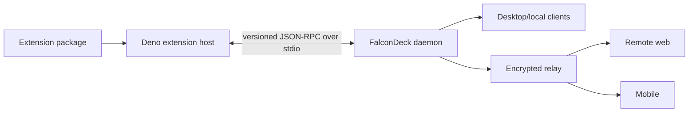

# FalconDeck Extensions

Status: canonical architecture and implementation plan. The v0 foundation and
Thread Colours vertical slice and the scoped declarative UI v1 foundation are
implemented; later capabilities are explicitly tracked below. Last reconciled
with the code on 2026-08-13.

This document is the source of truth for code that extends FalconDeck itself.
If implementation conflicts with it, update this document and record the
decision before merging. Wider product context lives in `docs/PLATFORM.md`;
the research behind this design lives in `docs/BB-ANALYSIS.md`.

### Implemented baseline

- bundled catalog and manifest discovery, with Thread Colours enabled by default;
- checked-in manifest schema and machine-readable validation diagnostics;
- daemon-owned enablement, namespaced JSON storage, bounded view projections,
  generic action routing, snapshot fields, sequenced events, HTTP, and relay RPC;
- a pinned Deno runtime bundled with desktop releases, with one lazy,
  supervised, read-only TypeScript host process per active extension;
- Extensions settings in desktop, plus synchronized projection rendering in
  desktop, remote web, and mobile;
- one-click Thread Colours context-menu selection, colour markers, optimistic
  updates, and sidebar filtering on desktop
  and remote web, with read-only colour markers on mobile;
- a bounded declarative UI v1 schema, public SDK types/builder, defensive client
  normalizer, shared web renderer, generic sidebar-filter host, and visible
  unsupported-contribution fallback;
- `packages/extension-testing`, with deterministic public-SDK activation,
  storage, actions, view publications, failure injection, declaration checks,
  daemon-equivalent limits, and atomic rollback;
- persistence, size/path validation, host-contract, normalization, and shared
  projection tests.

The following planned parts are not yet public API: user/local-path install,
permission grants beyond the baseline sandbox,
the remaining declarative form primitives and mobile renderer,
migrations/transactions beyond atomic
action commits, the full `create|test|dev|pack` CLI, archive signing/update, and
a bundled Deno executable for standalone daemon releases. Do not document those as
shipping behaviour until their phase gates pass.

## 1. Goal

FalconDeck extensions should let a user describe a capability to an agent and
have that agent build, validate, test, and locally enable it without the user
learning FalconDeck internals.

A representative request is:

> Add an extension that lets me tag threads, assign colours to tags, and
> filter the sidebar by tag.

The expected workflow is:

1. The agent reads this document and the extension SDK contract.
2. It scaffolds an extension with the FalconDeck CLI.
3. It implements against typed, named contribution points.
4. It validates the manifest and runs the fake-host tests.
5. It installs the extension from a local path in development mode.
6. FalconDeck shows the user its permissions and enabled state.

Humans provide intent and approve capabilities. Agents author packages. The
manifest, schemas, compiler errors, validation output, fixtures, and examples
are therefore more important than prose alone.

## 2. Terminology

- **Connector**: a tool exposed to an agent, such as an MCP server or skill.
- **Extension**: code that extends FalconDeck itself with UI, state, actions,
  events, automations, or agent-facing tools.
- **Host**: the Deno sidecar supervised by the daemon. It executes extension
  backend code outside the Rust daemon.
- **Contribution**: a declared addition to a named FalconDeck surface.
- **View state**: bounded, non-secret extension data published through the
  daemon for clients to render.
- **Private state**: namespaced extension data that remains daemon-side and is
  never included in ordinary client snapshots.

Use “extension” in code and product UI. “Plugin” is too easily confused with
agent connectors and framework plugins such as Tauri or Expo plugins.

## 3. Non-negotiable rules

1. **The daemon remains the authority.** Installation, enablement, permissions,
   storage, action routing, and synchronized view state belong to the daemon.
2. **Extension code never runs inside the Rust daemon.** The daemon supervises
   a versioned Deno host over JSON-RPC on stdio.
3. **Official extensions use only the public SDK.** Bundling can change source
   and default enablement, but never grants private APIs.
4. **No extension code runs in mobile.** Desktop, web, and mobile initially
   render declarative contributions and synchronized view state.
5. **Permissions are denied by default and enforced by the daemon.** Runtime
   sandboxing is defence in depth, not the product permission boundary.
6. **Extension state never becomes an ad hoc core field.** Use namespaced
   private state or entity-scoped view state.
7. **Unknown contributions degrade visibly.** Old clients preserve data and
   show a fallback rather than crashing or silently discarding it.
8. **Wire contracts are versioned and machine-checked.** Rust owns daemon
   protocol types; generated TypeScript and JSON Schema are published.
9. **One faulty extension fails alone.** Activation, actions, events, and
   shutdown have timeouts, size limits, and independent failure state.
10. **Extensions do not replace core data ownership.** Agent sessions remain
    owned by their harnesses; extensions may annotate and act on entities.

## 4. Repository and package layout

The target monorepo shape is:

```text
apps/
  extension-host/                # Deno supervisor and extension isolates
crates/
  falcondeck-extension-protocol/ # daemon <-> host types, if core grows too large
extensions/
  official/
    thread-tags/
    notepad/
  examples/
    hello-panel/
  catalog.json                   # FalconDeck-owned bundling/default policy
packages/
  extension-sdk/                 # public authoring API
  extension-testing/             # fake host, fixtures, assertions
schemas/
  extension-manifest.schema.json # generated and checked in for tooling
```

An authored extension is deliberately small:

```text
thread-tags/
  falcondeck.extension.json
  server.ts
  ui.ts                          # optional declarative helpers
  README.md
  tests/
```

Packages may contain assets and migrations. They may not import source files
from `apps/`, `crates/`, or private `packages/` paths. CI enforces the same rule
for official extensions.

Entrypoints import the SDK by its stable bare specifier:

```ts
import { defineExtension } from "@falcondeck/extension-sdk";
```

FalconDeck supplies the import map at runtime. Repository checks use
`--import-map=extensions/import-map.json`; authored packages must not depend on
the SDK's monorepo source location.

`extensions/catalog.json` is distribution policy owned by FalconDeck. It says
which official packages are bundled and enabled on fresh installation. An
extension cannot declare itself trusted or default-enabled in its manifest.

Initial policy:

- `falcondeck.thread-tags`: bundled and enabled by default.
- `falcondeck.notepad`: bundled but disabled by default once implemented.

## 5. Manifest contract

Every package contains `falcondeck.extension.json`, validated before code loads:

```json
{
  "$schema": "https://falcondeck.com/schemas/extension-manifest-v1.json",
  "id": "falcondeck.thread-tags",
  "name": "Thread Colours",
  "version": "0.2.0",
  "engines": { "falcondeck": "^0.1" },
  "entrypoint": "server.ts",
  "contributes": {
    "threadMenuActions": [{ "id": "manage-tags", "title": "Set colour" }],
    "threadDecorations": [{ "id": "tag-chips", "view": "thread-tags" }],
    "sidebarFilters": [
      { "id": "tags", "title": "Colours", "view": "tag-index" }
    ]
  },
  "permissions": []
}
```

Required properties are a globally unique reverse-domain-style id, name,
semantic version, supported extension API range, backend entrypoint, declared
contributions, and a permissions array. The v0.1 validator requires that array
to be empty because capability grants are not implemented yet; an extension
that requests an unenforced permission is rejected rather than run unsafely.

Paths are package-relative, cannot traverse (including through symlinks), and
must resolve beneath the installed root. Unknown manifest and contribution
properties fail validation so typos do not silently weaken the contract.

Contribution identifiers are durable. Renaming an action, view, or setting
requires an alias or migration because saved state may refer to it.

## 6. Public SDK

The TypeScript SDK exposes capability-shaped facets and declarative UI types,
never daemon transport or internal React stores:

```ts
export default defineExtension({
  async activate(context) {
    context.actions.register("manage-tags", async (invocation) => {
      const tags = await context.storage.get<Tag[]>("tags", []);
      // Return a declarative form or process submitted form data.
    });
  },
});
```

The implemented v0.1 `ExtensionContext` facets are `extension`, `log`,
`storage`, `views`, and `actions`. The remaining rows are planned capabilities:

| Facet       | Purpose                                                     |
| ----------- | ----------------------------------------------------------- |
| `extension` | Identity, installed version, API version, lifecycle signal  |
| `log`       | Structured, attributed diagnostics with redaction           |
| `storage`   | Namespaced private storage and transactions                 |
| `views`     | Publish bounded synchronized state declared by the manifest |
| `actions`   | Handle invocations from declared UI actions                 |
| `events`    | Planned: subscribe to permitted daemon lifecycle events     |
| `threads`   | Planned: permission-gated thread reads and annotations      |
| `commands`  | Planned: slash or command-palette commands                  |

Later facets may add schedules, notifications, agent tools, turn control,
workspace files, and mediated network access. Plausibility alone does not put a
facet into v1.

The v0.1 action registration is process-lifetime and returns `void`; disabling
the extension terminates that isolated host. Subscription facets introduced in
later slices return disposables and are released in reverse registration order.

`defineExtensionUi(...)` type-checks UI v1 documents while preserving literal
component, control, view, and action identifiers. The same checked document
shape is mirrored in Rust, `packages/client-core`, and
`schemas/extension-ui-v1.schema.json`.

## 7. State and synchronization

Extensions have two intentionally separate forms of state.

### Private state

Private state is daemon-owned, namespaced by extension id, and exposed only
through `context.storage`. v0.1 supports JSON get/set/delete, a 512 KiB limit
per extension, atomic whole-action commits, and retention while disabled.
Compare-and-swap, schema-versioned migrations, and user-facing data deletion
are later gates.

Secrets do not use ordinary storage. A later secrets capability must use
platform credential storage and opaque handles where practical.

### View state

View state is non-secret data intended for clients:

```ts
await context.views.publish({
  viewId: "thread-tags",
  scope: { kind: "thread", id: threadId },
  value: { tags: [{ id: "urgent", label: "Urgent", color: "red" }] },
});
```

The daemon validates and persists the latest projection, includes relevant
bounded projections in snapshots/detail responses, and emits sequenced updates
through the existing event stream. Relay encryption and replay work without a
second extension transport.

v0.1 limits action input to 64 KiB, each published view to 16 KiB, one action
to 256 publications, retained view state to 4 MiB per extension, and a host
response to 2 MiB. Large-data on-demand fetching is planned; until it exists,
extensions must publish summaries rather than payloads near these ceilings.
This split lets clients render tags or notepad summaries while the host
restarts without broadcasting private data.

## 8. Declarative UI

The first API provides named contribution points:

- thread context-menu actions;
- thread badges and decorations;
- sidebar filters;
- header and composer actions;
- command-palette and slash commands;
- settings sections;
- conversation cards;
- standalone panels.

Thread Colours uses the first three; its fixed palette is rendered directly in
the context menu and does not open a modal.

Contributions bind manifest declarations to view state and actions. The scoped
implemented v1 vocabulary is stack, row, text, badge, divider, button, list,
select, and standard loading, empty, and error states. Button bindings carry
only a declared action id, bounded literal input, and an optional literal
target. Select bindings carry a declared thread-scoped view id, a bounded safe
object path, and the `includes_any` comparison; clients keep the selection
itself local and never evaluate extension expressions.

The generic web host currently consumes `sidebarFilters`. Static manifest UI
lets a lazy extension render on first paint; a synchronized global projection
with the contribution's view id may replace that document later. Thread
Colours now uses this path, while its thread menu action and row decoration
remain on their existing shared compatibility adapter. Header/composer actions,
forms, modal hosts, colour picker, Markdown, icons, and the full mobile
vocabulary remain planned rather than silently treated as implemented.
Mobile shows an attributed notice when one or more enabled sidebar filters are
available on desktop/web; it does not silently discard the contribution.

The renderer supplies accessibility and keyboard semantics, theme tokens,
localization-ready strings, and validation without extension-authored CSS.
Documents are limited to 32 levels, 256 nodes, 256 select options, and 4,096
characters per text field, in addition to manifest and retained-view byte
limits. Bindings are data, not executable expressions. Newer or malformed
documents produce an attributed, inspectable fallback; newer contribution
kinds are listed by name in desktop Extensions settings even when that client
has no renderer for their surface.

Sandboxed webviews are a later desktop/web escape hatch. Mobile always needs a
useful declarative or generic fallback. Whole-region replacement, same-origin
scripts, arbitrary CSS, and direct store access are out of scope for v1.

## 9. Runtime and lifecycle



The daemon owns this lifecycle:

1. Discover bundled manifests from the FalconDeck-owned catalog.
2. Validate paths, compatibility, declarations, and the empty v0.1 permission set.
3. Validate static declarative UI and render it without starting extension code.
4. Lazily start that extension's host on its first executable action.
5. Activate the package and collect its action registrations.
6. Route a declared action with a bounded target, input, and private-state copy.
7. Validate and atomically persist the returned storage and view projections.
8. Publish status and view changes through the unified event stream.
9. Dispose the process on disable, shutdown, timeout, or protocol failure.

The daemon is the supervisor. Each extension executes in its own Deno process
with independent lifecycle, timeout, status, and runtime permissions. Calls
within one extension are ordered so its storage read, action, and atomic commit
cannot lose concurrent updates; different extensions can execute independently.
The isolation primitive may evolve without changing the daemon-host contract.

The next invocation lazily restarts a host after timeout, protocol failure, or
unexpected exit. Backoff, session circuit breaking, and transactional package
upgrades remain phase-gated work; failures never erase retained extension data.

## 10. Permissions and trust

Baseline capabilities need no prompt because they cannot reach user data beyond
the invocation context: identity, diagnostics, own storage, declared bounded
views, declared actions with a FalconDeck-supplied target, and declared UI.

Broader access is explicit and granular. Planned families are:

- `threads:read` and `threads:annotate`;
- `turns:start`, `turns:steer`, and `turns:interrupt`;
- `workspaces:read` and `workspace-files:read|write`;
- `network:<origin>`;
- `notifications:send`;
- `agent-tools:register`;
- lifecycle event subscriptions by event family.

The daemon checks every operation, not only activation, and reduces event
payloads to granted fields. Permission increases suspend an upgrade until the
user approves them.

Bundled means distributed by FalconDeck, not unrestricted. Default-enabled
official extensions stay within baseline capabilities unless the product has
an explicit first-run consent design.

## 11. Installation and enablement

The first supported sources are bundled packages, a local development
directory, and a packed local archive with a digest. Git and registry installs,
signatures, provenance, automatic updates, and a marketplace follow after the
local contract stabilizes.

Settings shows source, version, status, permissions, enable/disable control,
diagnostics, and data-removal control. Disabling retains data. Uninstalling code
and deleting data are separate operations.

Enablement is daemon-scoped initially so all paired clients see one coherent
feature set. Per-workspace enablement may come later without changing packages.

## 12. Agent authoring experience

The CLI is the corrective interface for extension-building agents:

```bash
falcondeck extension create thread-tags
falcondeck extension validate ./thread-tags --json
falcondeck extension test ./thread-tags --json
falcondeck extension dev ./thread-tags --json
falcondeck extension pack ./thread-tags --json
```

Commands provide stable JSON diagnostics with codes, file paths, JSON pointers,
and suggested repairs. Human output is a projection of the same diagnostics.

The scaffold contains the smallest valid manifest, typed lifecycle, a fake-host
test, fixtures for selected contributions, and an extension-local `AGENTS.md`
pointing here. It adds no unrelated placeholder dependencies.

The SDK exports types and builders. The manifest schema powers completion. The
implemented test package provides activation, private storage, declared action
invocation, bounded view publications, diagnostics, failure injection, and
atomic rollback. Permission grants, time control, and later SDK facets join it
in the same slice that introduces each capability.

Canonical starter prompt:

> Build a FalconDeck extension in this repository. Read
> `docs/EXTENSIONS.md`, scaffold it with `falcondeck extension create`, use
> only the public extension SDK, run validation and fake-host tests, test every
> contribution on supported clients, and list requested permissions before
> enabling it.

## 13. First official extension: Thread Colours

Thread Colours is bundled and enabled by default. Its durable package id stays
`falcondeck.thread-tags` so existing installations keep their data. A thread
with no colour produces no UI clutter. It is both useful and the acceptance
test for the architecture.

Initial behaviour:

- Assign one optional colour from a fixed Finder-style palette without typing.
- Remove a colour from the same thread context-menu picker.
- Show one compact coloured indicator in thread rows.
- Filter the sidebar by one or more colours.
- Preserve assignments across restart.
- Keep desktop, remote web, and mobile consistent through daemon snapshots and
  sequenced updates.
- Render tags read-only when a client cannot edit them.

Assignments live in private storage. The fixed filter palette is static
declarative manifest UI; per-thread colour assignments are synchronized view
state, and the action retains the global `tag-index` projection for older
clients. v0.1 named, multi-tag data migrates by retaining the
first assigned tag's colour for each thread.

Required contributions:

- `threadMenuActions.manage-tags`
- `threadDecorations.tag-chips`
- `sidebarFilters.tags`
- the shared system-colour context-menu renderer

Acceptance gate:

- no private import or special daemon method;
- disabling removes UI immediately but retains data;
- reenabling restores data without restart;
- a host crash leaves the last synchronized display available;
- permission denial fails closed and explains the unavailable action;
- snapshot plus replay convergence works on desktop, web, and mobile;
- malformed or oversized view state is safely rejected;
- the same SDK can build an equivalent third-party extension.

## 14. Implementation plan

Each phase ends in a tested contract. Do not broaden contributions before the
preceding gate is satisfied.

### Phase 0 — contract and repository skeleton

Deliver:

- this document and architecture cross-links;
- manifest v1 Rust/TypeScript types and generated JSON Schema;
- `packages/extension-sdk` identity and lifecycle types;
- `packages/extension-testing` skeleton;
- Thread Colours scaffold and official catalog entry;
- compatibility and diagnostic-code conventions.

Gate:

- a fixture validates identically in Rust, TypeScript, and CLI;
- official packages cannot import private workspace modules;
- CI detects generated schema drift.

### Phase 1 — daemon registry, storage, and protocol

Deliver:

- bundled and local-path discovery;
- persisted install, enabled, version, source, status, and permission records;
- transactional private storage with migrations;
- bounded entity-scoped view state;
- catalog and projections in snapshot/detail contracts;
- sequenced catalog/view events;
- generic `extension.action.invoke` and query RPCs;
- dynamic RPC registration shared by local and relay transports.

Gate:

- state survives restart and unknown data survives read-write cycles;
- local and paired clients converge after snapshot, replay, and replay pruning;
- disabled extensions receive no actions or events;
- Rust enforces every permission and limit.

### Phase 2 — Deno host and SDK execution

Deliver:

- supervised host with a versioned JSON-RPC handshake;
- per-extension activation, isolation, disposal, timeout, and diagnostics;
- SDK implementations for log, storage, views, actions, and lifecycle;
- transactional development reload;
- host packaging in desktop and standalone daemon distributions (desktop is
  implemented; standalone packaging remains planned).

Gate:

- throwing or hanging fixtures cannot affect another extension or daemon RPCs;
- restart preserves private and last-published view state;
- failed upgrade retains the previous version;
- desktop releases need no separately installed Deno runtime; standalone
  distributions must meet the same gate before that route ships.

### Phase 3 — declarative UI and settings

Deliver:

- versioned component and action-binding schema;
- shared web renderer in `packages/chat-ui`;
- mobile renderer for the v1 vocabulary;
- thread menu, decoration, sidebar filter, and modal/form hosts;
- Extensions settings and local-path installation;
- generic unsupported-contribution fallback.

Gate:

- accessibility and keyboard tests cover every primitive;
- desktop, remote web, and mobile render common fixtures coherently;
- an older client preserves state and shows an inspectable fallback;
- disabling disposes UI without a client reload.

Progress (2026-08-13): the panel-prerequisite subset is implemented: UI v1
wire/schema/SDK contracts, bounded validation, defensive normalization, the
shared web renderer, generic unsupported fallback, fake-host package, and the
generic `sidebarFilters` host proven by Thread Colours. Mobile vocabulary,
thread action/decoration generic hosts, forms/modals, and local-path install
remain open, so Phase 3 as originally scoped is not marked complete.

### Phase 4 — Thread Colours vertical slice

Deliver section 13 using only public SDK facets, enabled by default in the
official catalog.

Gate:

- daemon, relay, desktop, remote-web, and mobile integration tests pass;
- install/disable/enable/upgrade/restart/crash scenarios pass;
- a clean checkout can validate, test, and pack it with documented commands;
- repo-local autoreview is clean before shipping.

### Phase 5 — agent authoring release

Deliver:

- `create|validate|test|dev|pack` CLI commands;
- stable JSON diagnostics and repairs;
- generated public SDK reference;
- a minimal example distinct from Thread Colours;
- an end-to-end fresh-scaffold test;
- public starter prompt and contribution checklist.

Gate:

- another coding harness builds a small extension using only repository docs
  and command output;
- validation catches missing permissions, invalid bindings, incompatible API
  versions, unsafe paths, private imports, and untested contributions.

### Phase 6 — expand from demonstrated demand

Candidates include standalone panels for Notepad, settings, conversation cards,
automations, agent tools, schedules, and notifications. Each new capability
needs a permission, limits, fake-host support, client fallback, and official or
example consumer.

The active Phase 6 sequence is: finish the panel-scoped Phase 3 renderer
prerequisite; add standalone panels and the desktop main-view registry; add
permission grants plus summary-only `threads:read`; add bounded event delivery;
then prove the whole public surface with an official mini-Zen attention panel.
Permission enforcement comes before thread-bearing events so no temporary
unguarded read path ships.

Do not begin marketplace, signing, arbitrary webviews, whole-region UI
replacement, extension dependencies, or cross-extension calls until local
packages and Thread Colours exercise compatibility in real use.

## 15. Required test layers

Every capability needs all applicable layers:

1. Schema and compatibility tests.
2. SDK tests against the fake host.
3. Daemon permission, persistence, migration, and limit tests.
4. Host isolation, lifecycle, timeout, reload, and crash tests.
5. Shared renderer contract fixtures.
6. Desktop, remote-web, and mobile presentation tests.
7. Snapshot, replay, reconnect, and replay-pruning convergence tests.
8. Packaged desktop and standalone daemon smoke tests.
9. An official or example extension using no private APIs.

An SDK feature without fake-host support is incomplete. A UI contribution
without a mobile fallback is incomplete. A daemon operation without permission
and size limits is incomplete.

## 16. Compatibility policy

- API major versions are explicit in manifests and the host handshake.
- Additive optional fields are minor-compatible and preserved by readers.
- Removing or changing semantics requires a new major version.
- Contribution and view ids are persisted API, not display strings.
- Data migrations are extension-owned, ordered, transactional, and tested.
- FalconDeck may suspend incompatible code but keeps its record and data.
- Generic view/action envelopes remain readable when an extension is absent.

During initial development the API may be `0.x`, but breaking changes still
update fixtures, schemas, official extensions, and this document together.

## 17. Drift prevention checklist

Before changing the extension API, answer:

- Is this a connector feature or a FalconDeck extension feature?
- Can an official extension implement it without a private import?
- Is the daemon still authoritative for permissions, storage, and routing?
- Is data correctly split between private and bounded view state?
- Is the contribution named and declarative where possible?
- What happens on mobile and on an older client?
- What happens on host crash, extension hang, disable, and failed upgrade?
- Are wire types and schemas generated and versioned?
- Does the fake host expose the same behaviour?
- Which official or example extension proves the API?

If these questions lack concrete answers, the capability is not ready for the
public extension SDK.
