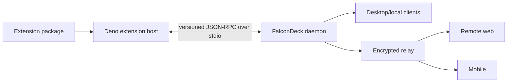

# FalconDeck Extensions

Status: canonical architecture and implementation plan. The v0 foundation and
Kanban vertical slice, scoped declarative UI v1, trusted official React
frontends, standalone panels, bounded lifecycle events, and permission-gated
summary reads are implemented; later capabilities are explicitly tracked
below. Last reconciled with the code on 2026-08-21.

This document is the source of truth for code that extends FalconDeck itself.
If implementation conflicts with it, update this document and record the
decision before merging. Wider product context lives in `docs/PLATFORM.md`;
the research behind this design lives in `docs/BB-ANALYSIS.md`.

### Implemented baseline

- bundled catalog and manifest discovery, with Kanban and Notes enabled
  by default;
- checked-in manifest schema and machine-readable validation diagnostics;
- daemon-owned enablement, namespaced JSON storage, bounded view projections,
  generic action routing, snapshot fields, sequenced events, HTTP, and relay RPC;
- a pinned Deno runtime bundled with desktop releases, with one lazy,
  supervised, read-only TypeScript host process per active extension;
- Extensions settings in desktop, plus synchronized projection rendering in
  desktop, remote web, and mobile;
- one-click Kanban stage selection, stage icons, optimistic
  updates, custom stage creation, and sidebar filtering on desktop
  and remote web, with read-only stage markers on mobile;
- a bounded declarative UI v1 schema, public SDK types/builder, defensive client
  normalizer, shared web renderer, generic sidebar-filter host, and visible
  unsupported-contribution fallback;
- named `panels` contributions rendered through the desktop main-view registry
  and remote web, with an explicit mobile fallback;
- optional trusted React frontend entries for bundled official extensions,
  built as lazy desktop/remote-web chunks with typed panel registrations,
  action routing, thread navigation, permission-reduced props, and per-panel
  crash containment;
- bounded, identifier-only lifecycle events delivered to disposable public-SDK
  subscriptions through independently supervised per-extension queues;
- daemon-owned, denied-by-default `threads:read` grants, summary-only thread
  reduction, local HTTP and relay RPC mutation, and desktop grant controls;
- the bundled, disabled-by-default Mini Zen proof extension, using public event,
  thread-summary, storage, and panel APIs with a useful pre-grant fallback;
- the bundled, enabled-by-default Notes panel, using private storage, a
  declared action, and a trusted React editor — a note list beside a Markdown
  editor — on desktop and remote web;
- optional host-owned panel icons from a bounded Lucide name allowlist,
  rendered in desktop and remote-web sidebar navigation;
- `packages/extension-testing`, with deterministic public-SDK activation,
  storage, actions, view publications, failure injection, declaration checks,
  daemon-equivalent limits, and atomic rollback;
- generic agent-tool registration: manifest-declared `agentTools`, the
  `agent-tools:register` grant, a dedicated `falcondeck-extensions` MCP bridge
  whose catalogue is discovered per session, and daemon-supplied thread and
  workspace context on every call;
- thread-scoped `composerSuggestions`: a bounded, daemon-validated projection
  of 1–5 next actions, retired by the daemon at every turn-start boundary,
  derived in `packages/client-core`, and rendered as one compact pill above the
  composer in desktop, remote web, and mobile;
- the bundled, enabled-by-default Follow-up suggestions extension, granted by
  catalog policy on first discovery;
- the public `orchestration` run/effect facet, denied-by-default
  `orchestration:manage-owned-tasks` grant, durable daemon journal, and bundled
  disabled-by-default Missions v1 reference with a permission-aware trusted
  dashboard on desktop and remote web;
- persistence, size/path validation, host-contract, normalization, and shared
  projection tests.

The following planned parts are not yet public API: user/local-path install,
third-party trusted-frontend building or loading,
permissions beyond summary-only `threads:read`, `agent-tools:register`, and
`orchestration:manage-owned-tasks`,
direct shell execution from an extension tool, trusted extension frontends for
third parties, persistent suggestion dismissals, Ask User Question, more than
one visible suggestion pill, the remaining declarative form
primitives and mobile renderer,
migrations/transactions beyond atomic
action commits, the full `create|test|dev|pack` CLI, archive signing/update, and
a bundled Deno executable for standalone daemon releases. Do not document those as
shipping behaviour until their phase gates pass.

## 1. Goal

FalconDeck extensions should let a user describe a capability to an agent and
have that agent build, validate, test, and locally enable it without the user
learning FalconDeck internals.

A representative request is:

> Add an extension that lets me tag threads, assign colours to tags, and
> filter the sidebar by tag.

The expected workflow is:

1. The agent reads this document and the extension SDK contract.
2. It scaffolds an extension with the FalconDeck CLI.
3. It implements against typed, named contribution points.
4. It validates the manifest and runs the fake-host tests.
5. It installs the extension from a local path in development mode.
6. FalconDeck shows the user its permissions and enabled state.

Humans provide intent and approve capabilities. Agents author packages. The
manifest, schemas, compiler errors, validation output, fixtures, and examples
are therefore more important than prose alone.

## 2. Terminology

- **Connector**: a tool exposed to an agent, such as an MCP server or skill.
- **Bridge**: the built-in `falcondeck-extensions` MCP server. It publishes
  enabled extensions' declared tools to a harness and owns no state of its own.
- **Extension**: code that extends FalconDeck itself with UI, state, actions,
  events, automations, or agent-facing tools.
- **Host**: the Deno sidecar supervised by the daemon. It executes extension
  backend code outside the Rust daemon.
- **Contribution**: a declared addition to a named FalconDeck surface.
- **View state**: bounded, non-secret extension data published through the
  daemon for clients to render.
- **Private state**: namespaced extension data that remains daemon-side and is
  never included in ordinary client snapshots.

Use “extension” in code and product UI. “Plugin” is too easily confused with
agent connectors and framework plugins such as Tauri or Expo plugins.

## 3. Non-negotiable rules

1. **The daemon remains the authority.** Installation, enablement, permissions,
   storage, action routing, and synchronized view state belong to the daemon.
2. **Extension code never runs inside the Rust daemon.** The daemon supervises
   a versioned Deno host over JSON-RPC on stdio.
3. **Official extensions use only the public SDK.** Bundling can change source
   and default enablement, but never grants private APIs.
4. **Trusted frontend code is explicit and client-specific.** Bundled official
   React frontends run only in desktop and remote web. Mobile renders
   declarative contributions or an attributed unsupported fallback.
5. **Permissions are denied by default and enforced by the daemon.** Runtime
   sandboxing is defence in depth, not the product permission boundary.
6. **Extension state never becomes an ad hoc core field.** Use namespaced
   private state or entity-scoped view state.
7. **Unknown contributions degrade visibly.** Old clients preserve data and
   show a fallback rather than crashing or silently discarding it.
8. **Wire contracts are versioned and machine-checked.** Rust owns daemon
   protocol types; generated TypeScript and JSON Schema are published.
9. **One faulty extension fails alone.** Activation, actions, events, and
   shutdown have timeouts, size limits, and independent failure state.
10. **Extensions do not replace core data ownership.** Agent sessions remain
    owned by their harnesses; extensions may annotate and act on entities.

## 4. Repository and package layout

The target monorepo shape is:

```text
apps/
  extension-host/                # Deno supervisor and extension isolates
crates/
  falcondeck-extension-protocol/ # daemon <-> host types, if core grows too large
extensions/
  official/
    thread-tags/
    notes/
    follow-up-suggestions/
  examples/
    hello-panel/
  catalog.json                   # FalconDeck-owned bundling/default policy
packages/
  extension-sdk/                 # public authoring API
  extension-testing/             # fake host, fixtures, assertions
schemas/
  extension-manifest.schema.json # generated and checked in for tooling
```

An authored extension is deliberately small:

```text
thread-tags/
  falcondeck.extension.json
  server.ts
  app.tsx                         # optional trusted React frontend
  ui.ts                          # optional declarative helpers
  README.md
  tests/
```

Packages may contain assets and migrations. They may not import source files
from `apps/`, `crates/`, or private `packages/` paths. CI enforces the same rule
for official extensions.

Entrypoints import the SDK by its stable bare specifier:

```ts
import { defineExtension } from "@falcondeck/extension-sdk";
```

Trusted frontends import only `@falcondeck/extension-sdk/app`. They register
typed slots and receive permission-reduced data, action invocation, and host
navigation as props. They do not import application stores or private source.

FalconDeck supplies the import map at runtime. Repository checks use
`--import-map=extensions/import-map.json`; authored packages must not depend on
the SDK's monorepo source location.

`extensions/catalog.json` is distribution policy owned by FalconDeck. It says
which official packages are bundled and enabled on fresh installation. An
extension cannot declare itself trusted or default-enabled in its manifest.

Initial policy:

- `falcondeck.thread-tags`: bundled and enabled by default.
- `falcondeck.notes`: bundled and enabled by default as a personal Markdown
  notes panel. It requests no permissions. It replaced `falcondeck.scratch-pad`
  in 0.3.0; the daemon moves that id's persisted state across on restore.
- `falcondeck.mini-zen`: bundled but disabled by default so enabling the
  opinionated panel remains an explicit choice; its requested `threads:read`
  permission is still denied until separately granted.
- `falcondeck.follow-up-suggestions`: bundled and enabled by default, and the
  first package to use a catalog `defaultGrantedPermissions` entry. Its
  `agent-tools:register` grant is applied once, on first discovery; afterwards
  the daemon-owned grant set is the only authority, so a revoked permission is
  never silently re-granted by a later restart or upgrade.
- `falcondeck.missions`: bundled and disabled by default. All three requested
  permissions remain denied until the user grants them; open runs pause if the
  extension or orchestration grant is disabled.

`defaultGrantedPermissions` is distribution policy for bundled official
packages. A manifest cannot claim it, and it never widens what the manifest
declared.

## 5. Manifest contract

Every package contains `falcondeck.extension.json`, validated before code loads:

```json
{
  "$schema": "https://falcondeck.com/schemas/extension-manifest-v1.json",
  "id": "falcondeck.thread-tags",
  "name": "Kanban",
  "version": "0.4.0",
  "engines": { "falcondeck": "^0.1" },
  "entrypoint": "server.ts",
  "frontend": "app.tsx",
  "contributes": {
    "threadMenuActions": [{ "id": "manage-tags", "title": "Set stage" }],
    "threadDecorations": [{ "id": "tag-chips", "view": "thread-tags" }],
    "sidebarFilters": [
      { "id": "tags", "title": "Stages", "view": "tag-index" }
    ],
    "panels": [{ "id": "board", "title": "Kanban", "view": "kanban-board", "icon": "kanban" }]
  },
  "permissions": ["threads:read"]
}
```

Required properties are a globally unique reverse-domain-style id, name,
semantic version, supported extension API range, backend entrypoint, declared
contributions, and a permissions array. `frontend` is optional and currently
accepted only as a build input for bundled official packages. The v0.1
validator accepts at most 16
unique permissions and currently recognizes `threads:read`,
`agent-tools:register`, and `orchestration:manage-owned-tasks`; unknown or duplicate permissions are rejected rather
than run without enforcement.

`panelActions`, `agentTools`, and `composerSuggestions` have no standalone
client-rendered declarative UI of their own. Panel actions are referenced by a
panel document; the other two bind agent tools and host-owned composer UI:

```json
{
  "contributes": {
    "agentTools": [
      {
        "id": "suggest-follow-ups",
        "title": "Suggest follow-ups",
        "description": "Offer the user 1-5 short next actions …",
        "inputSchema": { "type": "object", "properties": {} }
      }
    ],
    "composerSuggestions": [{ "id": "follow-ups", "view": "follow-ups" }]
  },
  "permissions": ["agent-tools:register"]
}
```

`agentTools` entries are capped at 8 per extension, need a 16–1024 character
model-facing description and an `inputSchema` describing a JSON object under
8 KiB, and require the `agent-tools:register` permission — a manifest that
declares tools without it fails validation rather than registering nothing.
`composerSuggestions` binds a declared thread-scoped view id to the
host-rendered composer pill and accepts no `ui` or `icon`, because the pill is
a host surface rather than an extension-authored document.

Paths are package-relative, cannot traverse (including through symlinks), and
must resolve beneath the installed root. Unknown manifest and contribution
properties fail validation so typos do not silently weaken the contract.

Contribution identifiers are durable. Renaming an action, view, or setting
requires an alias or migration because saved state may refer to it.

## 6. Public SDK

The TypeScript SDK exposes capability-shaped facets and declarative UI types,
never daemon transport or internal React stores:

```ts
export default defineExtension({
  async activate(context) {
    context.actions.register("manage-tags", async (invocation) => {
      const tags = await context.storage.get<Tag[]>("tags", []);
      // Return a declarative form or process submitted form data.
    });
  },
});
```

The implemented v0.1 `ExtensionContext` facets are `extension`, `log`,
`storage`, `views`, `actions`, identifier-only `events`, the permission-gated
`threads` summary reader, agent `tools`, `composer`, and the bounded owner-only
`orchestration` reducer. The remaining rows are planned capabilities:

| Facet       | Purpose                                                     |
| ----------- | ----------------------------------------------------------- |
| `extension` | Identity, installed version, API version, lifecycle signal  |
| `log`       | Structured, attributed diagnostics with redaction           |
| `storage`   | Namespaced private storage and transactions                 |
| `views`     | Publish bounded synchronized state declared by the manifest |
| `actions`   | Handle invocations from declared UI actions                 |
| `events`    | Subscribe to bounded identifier-only lifecycle events       |
| `threads`   | List summary-only threads with a `threads:read` grant       |
| `tools`     | Handle agent tool calls with an `agent-tools:register` grant |
| `composer`  | Publish or clear a thread's bounded next-action offers      |
| `orchestration` | Read owned bounded runs and return one durable effect   |
| `commands`  | Planned: slash or command-palette commands                  |

Later facets may add schedules, notifications, turn control, workspace files,
and mediated network access. Plausibility alone does not put a facet into v1.

The v0.1 action registration is process-lifetime and returns `void`; disabling
the extension terminates that isolated host. `events.on(type, handler)` returns
an idempotent disposable. Event handlers are ordered within one extension and
their storage/view effects commit atomically through the same daemon boundary
as actions.

The event union contains `thread.updated`, `turn.start`, `turn.ended`,
`attention.opened`, `attention.resolved`, and owner-targeted
`orchestration.updated`. Payloads contain only stable workspace, thread, turn,
request, and owned-run identifiers. Status, title, preview, prompt, transcript,
and resolution fields are deliberately absent. An extension that needs thread
or run metadata requests it separately through the declared, granted, and
enforced projection facet. Lifecycle delivery is bounded and lossy; events are
refresh hints, never a durable journal.

`context.threads.list()` fails closed unless the manifest declares
`threads:read` and the user has granted it. The returned projection is capped
at 1,000 most-recently-updated entries and 2 MiB, and contains only thread id,
workspace id, a title truncated to 256 characters, owning provider, status,
updated timestamp, and pending approval/question counts. Message previews, prompts, transcripts,
turn content, agent configuration, and filesystem paths never cross this v1
boundary.

### Agent tools

`context.tools.register(id, handler)` handles calls to a manifest-declared
`agentTools` entry. The handler receives the agent's arguments plus the thread
and workspace the calling turn belongs to:

```ts
context.tools.register("suggest-follow-ups", async ({ input, threadId }) => {
  // …
});
```

Registration fails closed without the `agent-tools:register` grant. Ordinary
tool context is projected from the harness spawn. Sensitive orchestration
effects additionally require an opaque daemon-issued bridge capability bound
to an exact task; request-body identifiers do not authorize them. Claude binds
directly at spawn. Codex binds a workspace bridge only when daemon state has
exactly one running Codex task in that workspace; an ambiguous call is denied.
OpenCode remains ineligible. A handler that raises is an
ordinary rejection — the message goes back to the calling agent as a tool error
and the extension keeps its healthy status, because models routinely pass
arguments an extension declines. Only a host that dies, times out, or breaks
the protocol marks the extension failed.

The same MCP bridge also publishes a daemon-owned `falcondeck_rename_thread`
tool whenever it is injected. That tool is not an extension: it applies a
3–7 word title to the calling thread so an agent can retitle a conversation
that has moved on. The rename dialog's Suggest title control is a separate,
user-initiated path that generates a candidate through the same cheap utility
models as auto-titling and fills the field without saving.

Published extension tool names must not contain `__` and must stay at most 41
characters. Clients such as Grok qualify every MCP tool as `server__tool` and
skip names that make that qualifier longer than 64 characters or split into
more than two parts. Follow-up suggestions therefore publishes as
`falcondeck_suggest_follow_ups`, not a concatenation of the full extension id
and tool id.

### Composer suggestions

`context.composer.publish(...)` offers a thread between one and five next
actions; `context.composer.clear(...)` withdraws them.

```ts
await context.composer.publish({
  viewId: "follow-ups",
  threadId,
  actions: [{ id: "ship", label: "Ship it", prompt: "Open a pull request." }],
  preferredActionId: "ship",
});
```

The bounds are owned by Rust and mirrored in the SDK and the fake host: 1–5
actions, labels of at most 30 characters, an optional single-line description
of at most 120, prompts of at most 512, and a `preferredActionId` that must
name one of the offered actions. An out-of-bounds set is rejected at the daemon
boundary rather than degrading across three renderers. Publishing an empty
`actions` array is the documented way to clear a thread's offers.

Staleness is the daemon's rule, not the extension's. Offers describe what to do
*next*, so the daemon retires a thread's composer-suggestion projections at its
turn-start boundary — the one provider-independent path every steer, queued
turn, and fresh dispatch passes through. Retirement emits the same
view-retraction event as a permission revoke, so every client drops the
projection rather than rendering an empty offer. An extension that tried to
manage this itself could only be right for harnesses that report a
turn-started notification, so extensions should keep no staleness state.

`defineExtensionUi(...)` type-checks UI v1 documents while preserving literal
component, control, view, and action identifiers. The same checked document
shape is mirrored in Rust, `packages/client-core`, and
`schemas/extension-ui-v1.schema.json`.

## 7. State and synchronization

Extensions have two intentionally separate forms of state.

### Private state

Private state is daemon-owned, namespaced by extension id, and exposed only
through `context.storage`. v0.1 supports JSON get/set/delete, a 512 KiB limit
per extension, atomic whole-action commits, and retention while disabled.
Compare-and-swap, schema-versioned migrations, and user-facing data deletion
are later gates.

Secrets do not use ordinary storage. A later secrets capability must use
platform credential storage and opaque handles where practical.

### View state

View state is non-secret data intended for clients:

```ts
await context.views.publish({
  viewId: "thread-tags",
  scope: { kind: "thread", id: threadId },
  value: { tags: [{ id: "urgent", label: "Urgent", color: "red" }] },
});
```

The daemon validates and persists the latest projection, includes relevant
bounded projections in snapshots/detail responses, and emits sequenced updates
through the existing event stream. Relay encryption and replay work without a
second extension transport.

v0.1 limits action input to 64 KiB, each published view to 16 KiB, one action
to 256 publications, retained view state to 4 MiB per extension, and a host
response to 2 MiB. Large-data on-demand fetching is planned; until it exists,
extensions must publish summaries rather than payloads near these ceilings.
This split lets clients render tags or note summaries while the host
restarts without broadcasting private data.

## 8. Declarative UI

The first API provides named contribution points:

- thread context-menu actions;
- thread badges and decorations;
- sidebar filters;
- header and composer actions;
- command-palette and slash commands;
- settings sections;
- conversation cards;
- standalone panels.

Kanban uses thread actions, decorations, filtering, and a standalone panel;
its named stages are rendered in a context-menu submenu and do not open a
modal to assign an existing stage.

Contributions bind manifest declarations to view state and actions. The scoped
implemented v1 vocabulary is stack, row, text, badge, divider, button, list,
select, and standard loading, empty, and error states. Button bindings carry
only a declared action id, bounded literal input, and an optional literal
target. Select bindings carry a declared thread-scoped view id, a bounded safe
object path, and the `includes_any` comparison; clients keep the selection
itself local and never evaluate extension expressions.

Composer suggestions are a host surface rather than a declarative document:
clients render exactly one compact pill above the composer, and only once the
associated turn is idle. The pill's primary segment submits its prompt as its
own turn without touching the user's draft; a chevron opens the alternatives
(a popover on desktop and remote web, a content-height bottom sheet on mobile);
a cross dismisses the offer for that turn. Dismissals are keyed by offer and
deliberately not persisted, so the next turn's suggestions arrive on their own.
When more than one enabled extension offers suggestions for the same thread,
clients render the alphabetically first extension's set, so the choice does not
depend on projection arrival order.

The generic web hosts currently consume `sidebarFilters` and `panels`. A panel
is a titled, named full-main-area surface and uses the same bounded global UI
document rules as other view contributions. Panels may declare an optional
`icon` from the host-owned Lucide allowlist (`activity`, `blocks`, `clock`,
`file-text`, `kanban`, `notebook`, `notebook-pen`, `sticky-note`); unknown
names fail validation, and older clients fall back to the generic panel icon.
Static manifest UI lets a lazy extension render on first paint; a synchronized
global projection with the contribution's view id may replace that document
later. Desktop registers core Activity and Settings takeovers plus extension
panels by stable view id; remote web renders the same panel/navigation
primitives. Kanban uses a dedicated stage filter so custom stages stay in
sync, while other extensions still use the generic filter path. Its thread
menu action and row decoration remain on their existing shared compatibility
adapter. Header/composer actions, forms, modal hosts, colour picker, Markdown,
declarative-UI icons, and the full mobile vocabulary remain planned rather
than silently treated as implemented. Mobile shows attributed notices for
enabled filters and panels, including the exact
panel-not-supported-here fallback; it does not silently discard either surface.

The renderer supplies accessibility and keyboard semantics, theme tokens,
localization-ready strings, and validation without extension-authored CSS.
Documents are limited to 32 levels, 256 nodes, 256 select options, and 4,096
characters per text field, in addition to manifest and retained-view byte
limits. Bindings are data, not executable expressions. Newer or malformed
documents produce an attributed, inspectable fallback; newer contribution
kinds are listed by name in desktop Extensions settings even when that client
has no renderer for their surface.

Sandboxed webviews are a later desktop/web escape hatch. Mobile always needs a
useful declarative or generic fallback. Arbitrary content scripts, unscoped
third-party CSS, and direct store access remain out of scope.

### Trusted React frontends

An optional manifest `frontend` entry gives a bundled official extension a
trusted React surface when declarative UI is too limited. The Vite extension
frontend plugin reads the official catalog at build time and emits one lazy
chunk per frontend. A frontend exports `defineExtensionApp(extensionId,
setup)` from `@falcondeck/extension-sdk/app` and registers components only for
manifest-declared slots. The host mounts a matching panel registration inside
the ordinary panel route and sidebar lifecycle.

The host owns React, routing, enablement, and daemon transport. Panel props
contain the extension's synchronized views, summary-only thread fields when
`threads:read` is granted, a typed action invoker, and a thread-navigation
request. Frontends do not receive message content, filesystem paths, daemon
credentials, or application stores through the SDK. Imports are built into
the host application, so React remains a singleton and a failed import or
panel render is contained to that extension surface.

This is a trust tier, not a security sandbox. Frontend JavaScript executes in
the application's page and can use browser globals. For that reason the
current implementation only builds repository-owned official frontends.
Third-party trusted frontend installation needs explicit full-trust consent,
SDK compatibility checks, automatic CSS scoping, bundle integrity metadata,
and update/reload lifecycle work before it can ship. Sandboxed HTML remains a
separate future capability for lower-trust custom UI. Mobile does not execute
React DOM frontends and continues to show the declared panel fallback.

## 9. Runtime and lifecycle



The daemon owns this lifecycle:

1. Discover bundled manifests from the FalconDeck-owned catalog.
2. Validate paths, compatibility, declarations, and the bounded v0.1 permission set.
3. Validate static declarative UI and render it without starting extension code.
4. Lazily start that extension's host on its first executable action or queued event.
5. Activate the package and collect its action registrations and event subscriptions.
6. Route a declared action, agent tool call, or identifier-only event with
   bounded input and a private-state copy.
7. Validate storage/views and any single owner-only orchestration effect. The
   orchestration checkpoint and operation intent commit atomically before an
   asynchronous provider side effect.
8. Publish status and view changes through the unified event stream.
9. Dispose the process on disable, shutdown, timeout, or protocol failure.

The daemon is the supervisor. Each extension executes in its own Deno process
with independent lifecycle, timeout, status, and runtime permissions. Calls
within one extension are ordered so its storage read, callback, and atomic
commit cannot lose concurrent updates; different extensions can execute
independently. Each enabled extension has a 256-event queue. When full, the
daemon drops the newest event and records a warning rather than allowing an
unbounded backlog or blocking another extension. Event payloads are capped at
4 KiB, subscriptions at 32 handlers per event type, and callbacks at five
seconds.
The isolation primitive may evolve without changing the daemon-host contract.

The next invocation lazily restarts a host after timeout, protocol failure, or
unexpected exit. Backoff, session circuit breaking, and transactional package
upgrades remain phase-gated work; failures never erase retained extension data.

## 10. Permissions and trust

Baseline capabilities need no prompt because they cannot reach user data beyond
the invocation context: identity, diagnostics, own storage, declared bounded
views, declared actions with a FalconDeck-supplied target, declared UI, and the
identifier-only lifecycle signals listed in section 6. Any event enrichment is
a read and remains unavailable until its permission is declared and granted.

The first explicit capability is `threads:read`. Grants are stored by the
daemon independently from enablement, denied by default even for bundled
extensions, restricted to permissions declared by the installed manifest, and
rechecked for every action or event callback. Revocation is serialized with an
extension's in-flight callback boundary. Its v1 projection is the bounded
summary shape in section 6; it does not expose message content. Revocation also
retracts that extension's synchronized view projections so previously derived
fields do not remain in future snapshots; namespaced private state is retained.

Broader planned families are:

- `threads:annotate` and richer separately named thread reads;
- `turns:start`, `turns:steer`, and `turns:interrupt`;
- `workspaces:read` and `workspace-files:read|write`;
- `network:<origin>`;
- `notifications:send`;
- lifecycle event subscriptions by event family.

The daemon checks every operation, not only activation. Lifecycle events remain
identifier-only even with a grant; extensions explicitly request the reduced
summary list through the gated SDK facet. Suspending upgrades that request new
permissions remains a later upgrade-system gate.

The second explicit capability is `agent-tools:register`. It lets an extension
publish its manifest-declared tools to agent harnesses through the built-in
`falcondeck-extensions` MCP bridge. Both the grant and enablement are checked
when the bridge lists tools and again when the daemon routes a call, so:

- disabling an extension or revoking the grant removes its tools from the next
  harness spawn's catalogue; and
- a harness that cached the old list has its call rejected immediately, before
  any extension code runs.

The bridge is only injected into a spawn when at least one enabled extension
currently publishes a granted tool, so a user with none pays for no subprocess.

Thread and workspace fields passed to a tool handler are transport context, not
model arguments. Sensitive facets still fail closed unless that connector has
an exact task binding. Claude's per-turn connector supplies one. Codex's
workspace connector is bound only when the daemon observes one running Codex
task for that provider and workspace. Two running tasks make the call
ambiguous and therefore unauthorized. OpenCode remains ineligible rather than
trusting a model-supplied task id.

The third explicit capability is `orchestration:manage-owned-tasks`. It exposes
only runs whose `ownerExtensionId` matches the callback's extension. A callback
may return at most one typed effect. The daemon validates actor class, owner,
task binding, compare-and-swap revision, checkpoint/prompt bounds, deadline,
and admission count before committing it. The effect commits the opaque
extension checkpoint and durable operation intent before provider dispatch;
extension code never waits for a harness.

The current slice supports one existing Claude or Codex coordinator task, an
initial 30-minute lease, at most four automatic coordinator turns, one
unresolved continuation, and at most three serial one-turn Codex workers.
Background dispatch uses an explicit safer execution profile and does not change current
task selection or the workspace default provider. Repeated progress
fingerprints, provider ambiguity, task errors, permission revocation, and
extension disable pause the run. Restart never blindly resends accepted work.
The owner may propose completion, but only a human panel action can accept it.
The bundled `falcondeck.missions` package is the reference consumer and is
disabled with all grants denied by default. Worker tasks are ordinary visible
FalconDeck tasks with durable Mission provenance; they cannot delegate, are
never retried after an ambiguous admission, and their bounded reports return
to the coordinator as untrusted input.

When Missions is enabled with all three grants, FalconDeck adds a short
provider-neutral Mission trigger to the injected agent context and stages the
`falcondeck-missions` workflow skill. An explicit request to start, create, or
run a Mission must call the draft tool before ordinary task work begins; it
must not silently degrade into a harness goal. Desktop and remote web also
surface a native `/mission` composer command. Completing it expands to clear
FalconDeck Mission intent, while the row stays hidden when the extension or a
required grant is unavailable.

Bundled means distributed by FalconDeck, not unrestricted. Default-enabled
official extensions stay within baseline capabilities unless the catalog grants
them a named permission as distribution policy — today only
`falcondeck.follow-up-suggestions` and only `agent-tools:register`.

## 11. Installation and enablement

The first supported sources are bundled packages, a local development
directory, and a packed local archive with a digest. Git and registry installs,
signatures, provenance, automatic updates, and a marketplace follow after the
local contract stabilizes.

Settings shows source, version, status, requested permissions, current grants,
grant/revoke controls, enable/disable control, and diagnostics. Disabling
retains data and grants. Data-removal controls remain planned; uninstalling code
and deleting data are separate operations.

Enablement is daemon-scoped initially so all paired clients see one coherent
feature set. Per-workspace enablement may come later without changing packages.

## 12. Agent authoring experience

The CLI is the corrective interface for extension-building agents:

```bash
falcondeck extension create thread-tags
falcondeck extension validate ./thread-tags --json
falcondeck extension test ./thread-tags --json
falcondeck extension dev ./thread-tags --json
falcondeck extension pack ./thread-tags --json
```

Commands provide stable JSON diagnostics with codes, file paths, JSON pointers,
and suggested repairs. Human output is a projection of the same diagnostics.

The scaffold contains the smallest valid manifest, typed lifecycle, a fake-host
test, fixtures for selected contributions, and an extension-local `AGENTS.md`
pointing here. It adds no unrelated placeholder dependencies.

The SDK exports types and builders. The manifest schema powers completion. The
implemented test package provides activation, private storage, declared action
invocation, lifecycle-event dispatch, disposable subscriptions, bounded view
publications, permission grants/revocation, reduced thread-summary reads,
diagnostics, failure injection, and atomic rollback. Time control and later SDK
facets join it in the same slice that introduces each capability.

Canonical starter prompt:

> Build a FalconDeck extension in this repository. Read
> `docs/EXTENSIONS.md`, scaffold it with `falcondeck extension create`, use
> only the public extension SDK, run validation and fake-host tests, test every
> contribution on supported clients, and list requested permissions before
> enabling it.

## 13. First official extension: Kanban

Kanban is bundled and enabled by default. Its durable package id stays
`falcondeck.thread-tags` so existing installations keep their data. A thread
with no stage produces no UI clutter. It is both useful and the acceptance
test for the architecture.

Initial behaviour:

- Assign one optional named stage from a default workflow set (Backlog, In
  progress, In review, Done, Canceled).
- Add a custom named stage from the same picker and assign it immediately.
- Remove a stage from the same thread context-menu picker.
- Show one compact stage icon in thread rows.
- Filter the sidebar by one or more stages.
- Open a full Kanban board from the sidebar on desktop and remote web.
- Move threads between columns with drag and drop and open a thread from its
  card.
- Preserve assignments across restart.
- Keep desktop, remote web, and mobile consistent through daemon snapshots and
  sequenced updates.
- Render stages read-only when a client cannot edit them.

Assignments live in private storage. Default filter options are static
declarative manifest UI for first paint; per-thread stage assignments and the
full catalog (including custom stages) are synchronized view state. Finder-style
colour assignments are dropped on first use rather than mapped onto stages.

Required contributions:

- `threadMenuActions.manage-tags`
- `threadDecorations.tag-chips`
- `sidebarFilters.tags`
- the shared stage context-menu renderer

Acceptance gate:

- no private import or special daemon method;
- disabling removes UI immediately but retains data;
- reenabling restores data without restart;
- a host crash leaves the last synchronized display available;
- permission denial fails closed and explains the unavailable action;
- snapshot plus replay convergence works on desktop, web, and mobile;
- malformed or oversized view state is safely rejected;
- the same SDK can build an equivalent third-party extension.

## 14. Implementation plan

Each phase ends in a tested contract. Do not broaden contributions before the
preceding gate is satisfied.

### Phase 0 — contract and repository skeleton

Deliver:

- this document and architecture cross-links;
- manifest v1 Rust/TypeScript types and generated JSON Schema;
- `packages/extension-sdk` identity and lifecycle types;
- `packages/extension-testing` skeleton;
- Kanban scaffold and official catalog entry;
- compatibility and diagnostic-code conventions.

Gate:

- a fixture validates identically in Rust, TypeScript, and CLI;
- official packages cannot import private workspace modules;
- CI detects generated schema drift.

### Phase 1 — daemon registry, storage, and protocol

Deliver:

- bundled and local-path discovery;
- persisted install, enabled, version, source, status, and permission records;
- transactional private storage with migrations;
- bounded entity-scoped view state;
- catalog and projections in snapshot/detail contracts;
- sequenced catalog/view events;
- generic `extension.action.invoke` and query RPCs;
- dynamic RPC registration shared by local and relay transports.

Gate:

- state survives restart and unknown data survives read-write cycles;
- local and paired clients converge after snapshot, replay, and replay pruning;
- disabled extensions receive no actions or events;
- Rust enforces every permission and limit.

### Phase 2 — Deno host and SDK execution

Deliver:

- supervised host with a versioned JSON-RPC handshake;
- per-extension activation, isolation, disposal, timeout, and diagnostics;
- SDK implementations for log, storage, views, actions, and lifecycle;
- transactional development reload;
- host packaging in desktop and standalone daemon distributions (desktop is
  implemented; standalone packaging remains planned).

Gate:

- throwing or hanging fixtures cannot affect another extension or daemon RPCs;
- restart preserves private and last-published view state;
- failed upgrade retains the previous version;
- desktop releases need no separately installed Deno runtime; standalone
  distributions must meet the same gate before that route ships.

### Phase 3 — declarative UI and settings

Deliver:

- versioned component and action-binding schema;
- shared web renderer in `packages/chat-ui`;
- mobile renderer for the v1 vocabulary;
- thread menu, decoration, sidebar filter, and modal/form hosts;
- Extensions settings and local-path installation;
- generic unsupported-contribution fallback.

Gate:

- accessibility and keyboard tests cover every primitive;
- desktop, remote web, and mobile render common fixtures coherently;
- an older client preserves state and shows an inspectable fallback;
- disabling disposes UI without a client reload.

Progress (2026-08-13): the panel-prerequisite subset is implemented: UI v1
wire/schema/SDK contracts, bounded validation, defensive normalization, the
shared web renderer, generic unsupported fallback, fake-host package, and the
generic `sidebarFilters` host proven by Kanban. The additive `panels`
contribution, desktop main-view registry, desktop/remote hosts, mobile fallback,
and event-driven Mini Zen proof are also implemented. Mobile vocabulary,
thread action/decoration generic hosts, forms/modals, and local-path install
remain open, so Phase 3 as originally scoped is not marked complete.

Progress (2026-08-18): bundled official packages may additionally declare a
trusted React frontend. Desktop and remote web build those entries as lazy
chunks and mount typed panel registrations; Kanban is the first proof. This
does not complete local-path installation or authorize third-party frontend
execution.

### Phase 4 — Kanban vertical slice

Deliver section 13 using only public SDK facets, enabled by default in the
official catalog.

Gate:

- daemon, relay, desktop, remote-web, and mobile integration tests pass;
- install/disable/enable/upgrade/restart/crash scenarios pass;
- a clean checkout can validate, test, and pack it with documented commands;
- repo-local autoreview is clean before shipping.

### Phase 5 — agent authoring release

Deliver:

- `create|validate|test|dev|pack` CLI commands;
- stable JSON diagnostics and repairs;
- generated public SDK reference;
- a minimal example distinct from Kanban;
- an end-to-end fresh-scaffold test;
- public starter prompt and contribution checklist.

Gate:

- another coding harness builds a small extension using only repository docs
  and command output;
- validation catches missing permissions, invalid bindings, incompatible API
  versions, unsafe paths, private imports, and untested contributions.

### Phase 6 — expand from demonstrated demand

Candidates include richer Notes agent sharing, settings, conversation cards,
automations, agent tools, schedules, and notifications. Each new capability
needs a permission, limits, fake-host support, client fallback, and official or
example consumer.

The active Phase 6 sequence is: finish the panel-scoped Phase 3 renderer
prerequisite; add standalone panels and the desktop main-view registry; add
bounded id-only event delivery; add permission grants plus summary-only
`threads:read`; then complete the official Mini Zen attention panel. Events do
not carry thread fields before permission enforcement, so no temporary
unguarded read path ships.

Progress (2026-08-13): this sequence is implemented end to end. Mini Zen is the
official proof: it subscribes to attention lifecycle events, persists a bounded
private queue, optionally resolves ids to granted summary titles, and publishes
its panel through declarative UI v1. Before the grant it still renders an
identifier-only attention count and generic thread label. It uses no private
imports and remains bundled, disabled by default.

Progress (2026-08-30): the neutral orchestration facet, `panelActions`
contribution point, durable run/operation/worker store, safe background task
and turn paths, fake-host support, and bundled Missions reference are
implemented. Desktop and remote web render Missions through the existing
shared extension-panel and action routes; mobile retains the generic
unsupported-panel fallback. Claude and unambiguous Codex tasks can coordinate;
up to three serial Codex workers are supported. OpenCode coordinator identity,
parallel worker pools, automatic completion, worker follow-ups, and native
harness delegation are not implemented.

Panel drift checklist (2026-08-13): panels are an extension feature; Mini Zen
uses only the public SDK; manifests and bounded view state remain daemon-owned;
the contribution is named and declarative; desktop and remote render it while
mobile explains the unsupported surface; older clients preserve/list the
unknown contribution; disabling removes it from normalized client definitions;
and static UI remains available through host crashes because no client code is
executed.

Event drift checklist (2026-08-13): lifecycle subscriptions are an extension
feature implemented entirely through the public SDK; the daemon selects and
reduces events, owns bounded per-extension queues, serializes callbacks with
actions, validates atomic effects, and stops delivery on disable; payloads are
identifier-only until read grants exist; no client executes extension code, so
older and mobile clients require no event-aware fallback; host crashes and
timeouts affect one extension and a later event lazily restarts it; the fake
host mirrors payload, handler, effect, and failure limits; Mini Zen consumes
attention open/resolved events without private imports.

Permission/read drift checklist (2026-08-13): `threads:read` is a FalconDeck
extension capability exposed only through the public SDK; the daemon persists
and validates explicit grants, rechecks them at each callback, and reduces data
to a 1,000-entry/256-title-character summary projection with no message content;
the fake host mirrors denial, grants, revocation, reduction, and limits; local
and remote grant mutation return the synchronized catalog shape; desktop
Settings exposes the requested-versus-granted state while older clients treat
the additive grant field as optional; disabling stops callbacks and summary
access without deleting the grant; host failure cannot widen access or erase
state; Mini Zen proves both granted and denied paths using only public APIs.

Do not begin marketplace, signing, arbitrary webviews, unreviewed third-party
trusted frontends, extension dependencies, or cross-extension calls until
local packages and Kanban exercise compatibility in real use.

## 15. Required test layers

Every capability needs all applicable layers:

1. Schema and compatibility tests.
2. SDK tests against the fake host.
3. Daemon permission, persistence, migration, and limit tests.
4. Host isolation, lifecycle, timeout, reload, and crash tests.
5. Shared renderer contract fixtures.
6. Desktop, remote-web, and mobile presentation tests.
7. Snapshot, replay, reconnect, and replay-pruning convergence tests.
8. Packaged desktop and standalone daemon smoke tests.
9. An official or example extension using no private APIs.

An SDK feature without fake-host support is incomplete. A UI contribution
without a mobile fallback is incomplete. A daemon operation without permission
and size limits is incomplete.

## 16. Compatibility policy

- API major versions are explicit in manifests and the host handshake.
- Additive optional fields are minor-compatible and preserved by readers.
- Removing or changing semantics requires a new major version.
- Contribution and view ids are persisted API, not display strings.
- Data migrations are extension-owned, ordered, transactional, and tested.
- FalconDeck may suspend incompatible code but keeps its record and data.
- Generic view/action envelopes remain readable when an extension is absent.

During initial development the API may be `0.x`, but breaking changes still
update fixtures, schemas, official extensions, and this document together.

## 17. Drift prevention checklist

Before changing the extension API, answer:

- Is this a connector feature or a FalconDeck extension feature?
- Can an official extension implement it without a private import?
- Is the daemon still authoritative for permissions, storage, and routing?
- Is data correctly split between private and bounded view state?
- Is the contribution named and declarative where possible?
- What happens on mobile and on an older client?
- What happens on host crash, extension hang, disable, and failed upgrade?
- Are wire types and schemas generated and versioned?
- Does the fake host expose the same behaviour?
- Which official or example extension proves the API?

If these questions lack concrete answers, the capability is not ready for the
public extension SDK.
