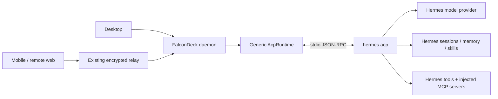

# Hermes Agent integration plan

Research and local verification: 2026-10-06. This is a proposed implementation, not a shipped Hermes integration.

## Recommendation

Use Hermes' existing `hermes acp` server through FalconDeck's generic ACP runtime. A user can configure this today without changing FalconDeck. Make Hermes a recommended agent, qualify its actual behavior, and fix demonstrated compatibility gaps before considering a native transport.

Hermes is an **agent harness** with its own model providers, tools, memory, skills, and sessions. Add `hermes` as the agent identity; keep the selected underlying model/provider inside Hermes. Connecting a Nous model as an OpenAI-compatible model provider would not run the Hermes agent.

Hermes documents three integration surfaces: ACP, its TUI gateway RPC, and an HTTP API. ACP fits FalconDeck's existing runtime. The gateway becomes useful if we need richer questions, native steering, or background-agent controls. Do not implement a Python embedding, scrape its terminal UI, or start another HTTP service for the initial release. [Hermes integration surfaces](https://hermes-agent.nousresearch.com/docs/developer-guide/programmatic-integration).

## What was verified

FalconDeck source inspected at `aa551a4a8dd442f0ad46852cd8fc8e02be8f57e5`. Upstream Hermes source inspected at [`1d6b2786e2b2de70a967c66b6a14e2b83bab30e7`](https://github.com/NousResearch/hermes-agent/tree/1d6b2786e2b2de70a967c66b6a14e2b83bab30e7).

This Mac already has `/Users/James/.local/bin/hermes`, reporting `Hermes Agent v0.14.0 (2026.5.16)`. Its source checkout is at `5a3317693c6ddd84834c4684eb6929ade20f0962`, so installed behavior and current upstream behavior are distinct baselines. The CLI's “Up to date” text is not evidence that this older checkout has current upstream features.

`hermes acp --check` passed. The existing FalconDeck conformance executable was also run against that installation in a temporary workspace:

```sh
target/debug/examples/acp_conformance --json --timeout-seconds 45 \
  --cwd /tmp/falcondeck-hermes-probe.2BCvsR \
  -- /Users/James/.local/bin/hermes acp
```

| Check | Observed result |
| --- | --- |
| ACP initialization | Passed, protocol version 1 |
| Session creation | Passed |
| Model discovery | Eight models |
| Session modes | Three edit modes |
| Separate permission/reasoning catalogs | Neither was exposed to this probe |
| Images | Advertised; no image sent to a model |
| MCP | HTTP/SSE not advertised; server execution untested |
| Authentication | Two methods advertised; interactive setup untested |
| Streaming, tools, cancellation, reload | Not exercised; require live qualification |

The executable predates the current checkout; rerun the current-source conformance example during implementation. This probe made no model calls. No Hermes provider was added to FalconDeck and no installation or upgrade was requested.

## How a user can connect it now

1. Install Hermes on the machine running the FalconDeck daemon, using its [official installation instructions](https://hermes-agent.nousresearch.com/docs/). This Mac already has it.
2. Run `hermes model` to configure its provider and model if needed. Run `hermes acp --check` to verify the adapter. If that fails because the ACP extra is missing, follow the installation-specific command in [Hermes' ACP guide](https://hermes-agent.nousresearch.com/docs/user-guide/features/acp).
3. Open **Settings → Agents → Add custom agent**. Set agent ID to `hermes`, label to `Hermes`, and command to `hermes acp`. If desktop PATH discovery fails on this Mac, use `/Users/James/.local/bin/hermes acp`.
4. Start a new task in the selected project folder and choose Hermes. Let FalconDeck launch the ACP process; there is no separately running Hermes server to manage.
5. Paired mobile and remote-web clients operate that same daemon and thread. Hermes is installed on the daemon host, not on the phone.

The equivalent configuration fragment is below. Merge it into the existing daemon-state `providers.json`; preserve all other entries. Prefer Settings, which already uses revision-checked writes.

```json
{
  "providers": {
    "hermes": {
      "label": "Hermes",
      "command": ["hermes", "acp"],
      "transport": "acp"
    }
  }
}
```

For a non-default Hermes home/profile, use that installation's launcher/profile selection and its supported `HERMES_HOME` override where appropriate. Never assume that a successful login in one profile configures another. Credentials remain in Hermes' own configuration; they do not belong in committed project configuration.

## Architecture and ownership



Reuse `ProviderRuntime`, `AcpRuntime`, the normalized conversation/event types, and the existing relay RPC contract. Rust and TypeScript provider IDs are already open strings; `hermes` requires no enum migration. Add protocol fields only for capabilities the existing contract cannot represent, starting in `falcondeck-core` and `client-core` together. See [ADAPTERS.md](ADAPTERS.md), [HARNESSES.md](HARNESSES.md), and [CONNECTORS.md](CONNECTORS.md).

FalconDeck owns task metadata, provider/session mappings, process supervision, user interaction, and synchronized projections. Hermes owns conversation persistence, model credentials, memory, learned skills, compression, and tool execution. Current upstream ACP sessions use Hermes' native `state.db`; do not add a FalconDeck conversation database or write directly to Hermes' session tables. [Hermes session implementation](https://github.com/NousResearch/hermes-agent/blob/1d6b2786e2b2de70a967c66b6a14e2b83bab30e7/acp_adapter/session.py).

## Phase 0: qualify the integration

**Expected effort: half to one day.** Treat this as the first implementation task, before advertising support.

- Record the installed executable, actual revision, ACP SDK/protocol version, and configured profile. Qualify a current supported Hermes installation as well as the existing older installation where practical. Do not silently upgrade a user's agent to run the experiment.
- Use current-source `acp_conformance` for discovery, then its live and restart modes in a disposable project. Confirm a complete text turn, one file read, one controlled edit, tool completion, cancel, and cross-process reload.
- Capture bounded, redacted wire fixtures for session metadata, model IDs, permission requests, images, history replay, usage, and errors. Tests must use these shapes through FalconDeck's production parser.
- Test the missing-dependency, missing-credential, bad-model, and provider-error cases. Initialization success alone is not evidence that a model can run.
- Verify that errors emitted as assistant text or `end_turn` cannot incorrectly become a successful task completion. The current upstream adapter has paths where executor failures return `end_turn`; inspect actual emitted error behavior before choosing a fix.

Developer qualification commands:

```sh
cargo run -p falcondeck-daemon --example acp_conformance -- \
  --cwd /path/to/disposable-project -- hermes acp

cargo run -p falcondeck-daemon --example acp_conformance -- \
  --live --restart --timeout-seconds 90 \
  --cwd /path/to/disposable-project -- hermes acp
```

Live mode spends model tokens and runs controlled commands. Use developer credentials and a disposable checkout. The existing probe does not establish denial behavior, connector isolation, image understanding, or crash-mid-turn recovery; those need focused cases.

**Exit:** a recorded compatibility matrix separates verified behavior, unsupported behavior, and upstream issues. Stop treating advertised capabilities as completed tests.

## Phase 1: make Hermes discoverable

**Expected effort: half to one day.**

- Add a Hermes card to `RECOMMENDED_AGENTS` in `apps/desktop/src/components/settings/AgentsPanel.tsx`, using `['hermes', 'acp']` and ACP transport. The existing custom `hermes` entry must count as already configured; never replace its command, profile, or environment.
- Add a curated `KnownHarness` entry in `crates/falcondeck-daemon/src/app/harness_manager.rs`. Probe the resolved executable and prefer the concise `acp --version` surface if confirmed against supported installations. No npm package exists for this harness in the current registry workflow: leave npm/latest-version fields unset.
- Check `agent_binary.rs` against standard Hermes launchers, minimal GUI PATH, explicit paths, and paths containing spaces. Extend known locations only if the real installations need it.
- Show installation instructions and an out-of-band `hermes model` setup action. ACP stdio is transport, so interactive setup must run in a real terminal rather than inside a conversation process.
- Start with detection and manual update guidance. Only offer managed upgrades after install ownership is classified. Source checkouts use `hermes update`; packaged desktop, Docker, Nix, and other distributions have different owners. Do not blindly run the source installer over an existing installation or promise “Latest” without an authoritative comparison. [Hermes update ownership](https://hermes-agent.nousresearch.com/docs/getting-started/updating).
- Use existing provider labels and the generic mark initially. A shared Hermes mark can be added in `packages/client-core/src/provider-marks.ts` after checking `DESIGN.md` and upstream branding/licensing.

**Exit:** Add/configure/recognize/remove works without a daemon restart; the harness panel identifies the executable actually used; existing custom configuration survives.

## Phase 2: correct the runtime and interaction gaps

**Expected effort: one to two days, plus any upstream turnaround.** Primary files: `acp.rs`, `app/acp_threads.rs`, `agent_context.rs`, and `connectors.rs`.

### Models and modes

Preserve Hermes' complete model IDs, including provider-qualified and named custom endpoints. Consume its discovered inventory; do not maintain a duplicate provider/model catalog in FalconDeck. Apply changes through the existing ACP model setter and preserve the old selection on rejection. Verify MCP tools remain available after a model switch.

Hermes' `default`, `accept_edits`, and `dont_ask` modes govern **file-edit approval**. They do not mean plan mode, filesystem sandboxing, or unrestricted terminal execution. Keep these meanings visible. Test their interaction with FalconDeck's separate generic ACP permission policy, including its full-access fallback for adapters without a permission catalog. Respect saved user choices and ensure the displayed policy matches executed behavior. Do not label “Don't Ask” as full shell access. [Hermes model/mode implementation](https://github.com/NousResearch/hermes-agent/blob/1d6b2786e2b2de70a967c66b6a14e2b83bab30e7/acp_adapter/server.py).

Expose reasoning/effort only when the selected supported adapter actually provides a working setting. The local probe found no reasoning catalog.

### FalconDeck instructions

FalconDeck currently sends its guidance in `session/new.instructions`. Both inspected Hermes versions accept extra session parameters but do not consume this field. MCP injection therefore does not establish that the agent received FalconDeck's tool guidance.

Preferred fix: a small upstream ACP adapter change that consumes the session instructions, appends them to Hermes' agent instructions, persists them across load/fork/compression, and keeps Hermes' memory/identity intact. Specify this as an agreed adapter extension; do not claim it is a standard ACP field.

If upstream delivery is unavailable, provide a bounded FalconDeck-side prompt-context fallback for Hermes in the daemon. Keep the user-visible message separate from injected guidance using the existing user-text projection machinery. Deliver context consistently after reload, preserve image-only prompts, and bypass prefixing for recognized Hermes slash commands so `/model` and `/compress` still dispatch. Do not edit the project's `AGENTS.md` or copy guidance into the user's personal memory. Qualify compression/restart behavior before shipping this fallback.

### Approvals, cancellation, and steering

Route ACP permissions through the existing durable interactive-request queue. Preserve option IDs and once/session/persistent scope; do not infer scope from English labels. Denial, timeout, cancel while waiting, and disconnect must settle tool/request state correctly. Verify both dangerous-command and pre-execution edit approvals. Test two simultaneous threads to catch callback or request routing leaks. [Terminal approval bridge](https://github.com/NousResearch/hermes-agent/blob/1d6b2786e2b2de70a967c66b6a14e2b83bab30e7/acp_adapter/permissions.py), [edit approval bridge](https://github.com/NousResearch/hermes-agent/blob/1d6b2786e2b2de70a967c66b6a14e2b83bab30e7/acp_adapter/edit_approval.py).

Initially use FalconDeck's existing generic ACP cancel/resubmit steering behavior. Hermes also has `/steer`, but wiring it to an in-flight turn requires verifying concurrent-request and task-lifecycle semantics; do not silently equate it with the generic fallback. Cancel must stop the relevant tools/delegations and leave the next prompt usable.

**Exit:** a streamed turn, model change, edit-mode change, denied action, cancelled turn, and next turn behave consistently on the normalized event path.

## Phase 3: preserve native history and connector identity

**Expected effort: one to two days.**

- Persist the normal FalconDeck thread-to-ACP-session mapping. Rehydrate using `session/load`, with replay routing registered before awaiting its response. Test warm-runtime retirement, daemon restart, long transcript replay, and no duplicate user/tool messages.
- Current upstream keeps a stable ACP handle while compression can rotate the internal Hermes session head. Store the ACP handle as the resume identity. Hermes' additive `_meta.hermes.sessionProvenance` may support a later compression marker; never replace the resume handle with the current internal head ID. Test compression followed by restart explicitly. [Provenance implementation](https://github.com/NousResearch/hermes-agent/blob/1d6b2786e2b2de70a967c66b6a14e2b83bab30e7/acp_adapter/provenance.py).
- A failed reload must be visible. Inspect the generic runtime's fresh-session fallback and ensure it cannot silently present lost context as a continuation of the old conversation.
- Initial scope is FalconDeck-created Hermes threads. Optional “Import Hermes sessions” should use ACP `session/list`, preserve paging/cwd/profile boundaries, and be explicit. Current upstream listing filters to ACP-source sessions, so it does not promise import of all CLI/messaging history. Avoid direct SQLite readers until a real supported import requirement exists.
- Pass built-in FalconDeck, extension, computer-use, and user connectors through `session/new` and `session/load`. Exercise one stdio connector through a tool call, including per-thread capability/thread identity.
- Hermes accepts HTTP/SSE server shapes in source, but the tested handshake does not advertise those transports. Preserve capability negotiation; do not force support based on a Python type signature. An upstream advertisement fix needs an end-to-end test; otherwise describe the connector limitation.
- Test same-named connector instances across simultaneous threads, config changes between turns, and model switches. Hermes' MCP registration involves shared discovery, so verify that thread-scoped credentials/tool context cannot be overwritten by another session. Fix at the actual owner rather than adding a second connector configuration store.
- Keep native memory and learned skills under the selected Hermes home. The ACP toolset already includes memory and skills tools; they do not need to be reimplemented in FalconDeck. Shared skill selection can use the existing prompt-reference path first. A browsable Hermes-native skill catalog is a separate enhancement. [ACP toolset](https://hermes-agent.nousresearch.com/docs/user-guide/features/acp).

**Exit:** the same thread resumes after retirement/restart/compression, and an injected tool call is bound to the correct calling thread.

## Phase 4: ship the same experience to every client

**Expected effort: one to two days including release checks.**

- Desktop, remote web, and mobile should render Hermes through the existing capability/data-driven agent selector, composer, transcript, and request UI. Keep provider behavior in ingestion/runtime code.
- Verify model/mode selection, assistant streaming, file diffs, usage where emitted, images with a vision-capable model, attachment fallback, pending approvals, cancellation, and reconnection on all clients.
- Test relay replay pruning followed by fresh daemon snapshot recovery while a Hermes permission request is pending. Native Hermes storage and the daemon projection remain authoritative.
- Confirm unknown/additive fields degrade on older clients. Any new capability/request field starts in `falcondeck-core` plus `client-core` types and normalizers; register new remote methods and their dispatch tests together only if actually needed.
- Add deterministic fixtures and focused tests to existing ACP, connector, settings, and shared-client suites. Run current-source live/restart qualification against the supported Hermes baseline. Do not broaden unrelated tests or refactor all adapters for this integration.
- Run the repository-local autoreview on implementation changes, verify findings against the actual paths, fix in-scope issues, and rerun as required by `AGENTS.md`. Commit only Hermes work on main; no PR unless requested.
- Update `docs/HARNESSES.md`, `docs/ADAPTERS.md`, `docs/GETTING-STARTED.md`, the agent settings copy, and README support claims. State the tested version/revision and actual limits.

**Release acceptance:** a user can configure Hermes, complete a tool-using task, continue it after restart, and approve/cancel it from a paired phone. Codex and Claude paths retain their current behavior.

## Phase 5: richer Hermes control, only where needed

**Separate follow-up: roughly one to two additional weeks, depending on scope.**

The default ACP toolset retains Hermes memory, skills, web/file/terminal tools, and delegation, while excluding messaging delivery, cron management, and interactive clarify UI. Therefore the first release is a coding/task integration, not a complete mirror of Hermes Desktop or its gateway.

If those omitted interactions matter, prototype a `HermesRuntime` over Hermes' TUI gateway stdio RPC behind `ProviderRuntime`. Verify the gateway launch command and protocol against the chosen baseline, then implement capability negotiation, `client.capabilities`, sessions, stream normalization, requests, cancellation, native steering, reconnect replay/open requests, and bounded process retirement. Keep sensitive requests such as secrets and sudo distinct from ordinary permission choices. Do not send sensitive answers through an ordinary chat-message path. [Gateway methods and request negotiation](https://hermes-agent.nousresearch.com/docs/developer-guide/programmatic-integration).

A gateway rollout must preserve existing ACP session mappings and prove cross-surface history loading; transport switching is not safe merely because both surfaces use Hermes' core. Keep ACP explicit and reversible. Do not add an automatic ACP-to-gateway fallback until launch/read/dispatch failures can be distinguished without duplicate turns.

Keep scheduling ownership clear. FalconDeck automations can launch normal Hermes tasks through the daemon; that does not require Hermes' cron tool. Hermes-native jobs still belong to Hermes and require its supported running gateway/service. Add a separately labeled read/control surface only if requested, avoiding duplicate schedulers for the same job.

For unattended/server use, run Hermes on the enrolled FalconDeck daemon host and persist its selected home, including native session state, memory, skills, and configuration. A local Hermes agent with remote execution tools still needs the local daemon/agent running. Integrate whole-agent sandbox placement through the existing [cloud execution proposal](CLOUD-EXECUTION-UX.md), rather than creating Hermes-specific cloud orchestration.

## Delivery order and estimate

| Increment | Concrete deliverable | Dependency |
| --- | --- | --- |
| 0 | Current-source compatibility report and recorded fixtures | Supported Hermes install and developer model credentials |
| 1 | Recommended card, reliable detection, clear setup | Discovery qualification |
| 2 | Correct model/mode/approval semantics and agent guidance | Fixtures; upstream instruction support or tested fallback |
| 3 | Restart/compression recovery and verified MCP identity | Live turn and connector qualification |
| 4 | Desktop/mobile/remote validation and documented release | Increments 1–3 |
| 5 | Optional native gateway controls | Evidence that ACP omits required user behavior |

Budget approximately **five to nine engineering days** for first-class ACP support if qualification reveals modest fixes. Basic manual configuration takes minutes and was already shown to reach session/catalog discovery on this Mac. External Hermes fixes can extend elapsed time. Full gateway support is separate scope, not a prerequisite for the recommended ACP release.

The next concrete implementation task is Phase 0 plus the recommended-agent/detection slice. Proceed to deeper adapter work only from the compatibility findings, while retaining native session ownership and the shared client contract.
